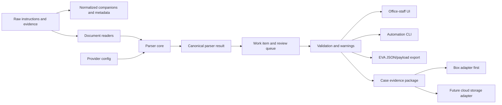

# Architecture Overview

CCC is Operational Core first, with parser as the first executable MVP. The initial architecture separates source preservation, extraction, provider rules, canonical work items, review/audit, EVA export, UI, CLI, and storage adapters.

## Boundaries

- UI and CLI do not implement extraction rules. They call the parser core.
- Provider detection and field extraction are configuration-backed and testable.
- EVA export is an adapter from canonical parser output, not the canonical model itself.
- Box is the first storage integration, but storage must remain replaceable.
- Cloud OCR/document intelligence is a later adapter, not the default parser runtime.

See also:

- `docs/architecture/programme_architecture.md`
- `docs/architecture/mvp_interlock.md`
- `docs/architecture/governance_security.md`
- `docs/architecture/future_system_convergence.md`
