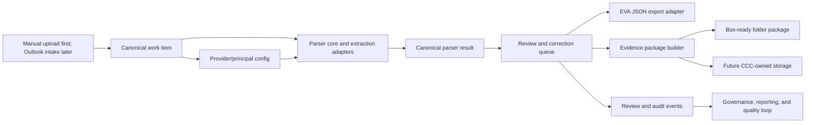

# Programme Architecture

CCC is the Collision Command Centre for vehicle damage instruction processing. The programme architecture is intentionally broader than the first parser MVP so that parser work, provider configuration, review queues, evidence packages, and future integrations converge into one operating model.

## Programme Shape

## First Programme Milestone

The first programme milestone is the Operational Core MVP:

- parser core for current corpus file types;
- non-technical staff UI and equivalent CLI over the same parser core;
- provider/principal admin UI;
- work-item and review queue;
- Box-ready evidence package generation;
- EVA JSON export validation;
- audit events for manual corrections and approvals.

Parser remains the first executable MVP inside that wider core because parsed instruction data is the foundation for review, packaging, and EVA export.

## Core Boundaries

| Boundary | Rule |
| --- | --- |
| Source preservation | Raw `docs/reference/raw/collisionrelateddocs/` evidence stays immutable. Normalized Markdown companions are reference aids, not replacements. |
| Extraction | Parser core produces canonical parser results with provenance, confidence, and validation warnings. |
| Provider rules | Provider/principal configuration is editable through an audited admin UI and versioned before activation. |
| Work item | Work items track lifecycle, missing information, review status, EVA export status, and package status. |
| EVA | EVA-ready JSON is generated from canonical data after validation and review gates. Direct Sentry submission is future work. |
| Storage | Box package generation is first. Live Box upload and CCC-owned cloud storage are later adapters. |
| AI and OCR | Deterministic extraction is first. OCR/cloud/AI adapters are fallbacks or future feature-flagged services. |

## Runtime Slices

1. Parser slice: file triage, document classification, extraction adapters, provider detection, mapping engine, validation, canonical result.
2. Operational slice: work items, queue views, review/correction workflow, audit events, package generation.
3. Configuration slice: provider/principal records, mapping rules, aliases, activation, rollback, validation.
4. Integration slice: EVA export, Box-ready package, later Outlook intake, live Box, Sentry/EVA API, storage adapters.
5. Intelligence slice: valuation support, mileage estimation, image quality/order checks, duplicate evidence review, engineer pack generation.

## Data Flow Principles

- A file can be parsed more than once, but each parse run must be traceable to source hashes, parser version, provider config version, and extraction methods.
- Manual corrections must not overwrite raw extracted evidence; they create review/audit events and produce a reviewed result.
- Provider config changes must be versioned and tested against the private real corpus before activation.
- Export adapters must fail closed when required fields or image ordering gates are not satisfied.
- Later cloud services must return structured provenance or be wrapped in adapter metadata that records source file, page, method, confidence, and operator approval.

## Future Integration Position

Outlook intake, live Box upload, direct EVA/Sentry submission, valuation automation, WhatsApp/communications drafting, cloud document intelligence, and analytics are planned but not part of the first parser runtime build. They appear in later tickets so their contracts can be considered now without building them prematurely.

