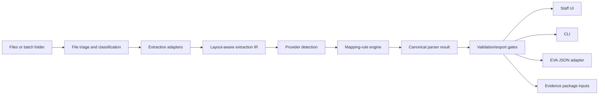

# Parser MVP Implementation Plan

Date: 2026-05-23

Status: active implementation plan. When implemented, move this plan to `docs/plans/parser-extraction/archived_plans/implemented/`, rename it with the implementation date, and add an implemented-state block at the top.
Owner: unassigned
Created: 2026-05-23
Last reviewed: 2026-05-24
Source links: `docs/reference/raw/collisionrelateddocs/`, `docs/reference/normalized/`, `docs/reference/data/provider_coverage_matrix.md`, `docs/reference/adjacent_repositories.md`, `docs/plans/parser-extraction/parser-mvp/adjacent-parser-and-inspection-location-review.md`, `docs/reference/raw/collisionrelateddocs/Settings Backup/providers.json`, `docs/reference/raw/collisionrelateddocs/Final Format Example 02.json`, `docs/reference/raw/collisionrelateddocs/collision_releated/Sentry_API_Complete_Guide.md`, `docs/reference/raw/collisionrelateddocs/collision_releated/Backup of CE Job Sheet 260309.xlsm`, `docs/operations/job_sheet_spreadsheet_companion.md`, `docs/reference/data/jam_exports/collisionrelateddocs__collision_releated__collision-engineers-whiteboard.jam/figma_inspection.md`, `docs/research/`, `docs/reference/originalplanning/`
Roadmap milestone: P1 Operational Core MVP
Dependencies: P0 contracts baseline, provider coverage baseline, source synthesis map
Expected outputs: deterministic parser core, staff UI workflow, CLI workflow, validation/export gates, EVA JSON export, evidence-package manifest inputs, golden corpus tests
Acceptance criteria: office and automation users can parse, review, validate, export EVA JSON, and prepare evidence packages using shared parser services
Verification required: `python tools/verify_scaffold.py`, parser corpus regression tests, UI/CLI parity tests, EVA field-order tests
Archive target: `docs/plans/parser-extraction/archived_plans/implemented/`
Supersedes: none
Superseded-by: none

## Objective

Build the first executable parser MVP inside `docs/plans/parser-extraction/`: a deterministic-first instruction parser with non-technical staff UI and equivalent CLI. The parser must handle the current private corpus and produce reviewed EVA-ready JSON plus Box-ready evidence package inputs.

## Success Criteria

An office user can upload instruction/evidence files, run extraction, review source-linked fields, correct warnings, validate EVA export gates, set image preview ordering, export EVA JSON, and generate the evidence-package manifest. An automation user can perform equivalent actions through the CLI using the same parser core.

## Scope

In scope:

- file triage and document classification;
- PDF, DOCX, legacy DOC, MSG, EML, images, and batch folders;
- provider detection and mapping-rule engine;
- all 26 current provider presets;
- canonical parser result with provenance/confidence/warnings;
- UI and CLI parity;
- EVA JSON export gate and field order;
- image package ordering rules;
- private corpus golden tests.

Out of scope for parser MVP:

- live Box upload;
- direct Sentry/EVA submission;
- autonomous Outlook intake;
- autonomous WhatsApp or email sending;
- valuation automation;
- out of scope: personal injury or KADOE workflows;
- cloud document intelligence as default runtime.

## Required Reference Review Before Implementation

Before implementation starts, the implementer must read and cite the following sources in the implementation ticket or PR notes:

| Source | Required use |
| --- | --- |
| `docs/plans/parser-extraction/parser-mvp/adjacent-parser-and-inspection-location-review.md` | Decision register, inspection-location policy, EVA/Sentry lookup constraint, and adjacent-repo comparison. |
| `docs/reference/adjacent_repositories.md` | Confirms which adjacent repositories are behavior references, experiments, or contract scaffolds. |
| `../cedocumentmapper/app.py` | Official current behavior oracle for extraction cascade, provider detection, field rules, inspection-address normalization, and export gates. Do not import the monolith wholesale. |
| `../collisionpdf/` | Reuse ideas for extraction IR, provenance, schema validation, and warning taxonomy. Do not treat synthetic tests as production parity evidence. |
| `../cedocumentmapper_v2.0/docs/architecture/module-boundaries.md` and `../cedocumentmapper_v2.0/docs/contracts/module-interfaces.md` | Use module-boundary and protocol ideas where they preserve thin UI/CLI and shared parser core. |
| `../cedocumentmapper_v2.0/docs/migration/v1-to-v2.md` and `../cedocumentmapper_v2.0/docs/tickets/EPIC-08-regression-harness.md` | Use migration and regression-harness shape for provider parity work. |
| `docs/reference/raw/collisionrelateddocs/Instructions/` | Authoritative real instruction corpus. Each raw source must remain immutable. |
| `docs/reference/normalized/` | Companion text for corpus review and fixture authoring. |
| `docs/reference/raw/collisionrelateddocs/Settings Backup/providers.json` | Authoritative current 26 provider presets until migrated into versioned config fixtures. |
| `docs/reference/raw/collisionrelateddocs/Final Format Example 02.json` | Required EVA JSON field order and six-line `Inspection Address` output example. |
| `docs/reference/raw/collisionrelateddocs/collision_releated/Sentry_API_Complete_Guide.md` | EVA/Sentry adapter constraints; no MVP dependency on undocumented location lookup. |
| `docs/reference/raw/collisionrelateddocs/collision_releated/Backup of CE Job Sheet 260309.xlsm` | Operational principal, job, and garage lookup evidence. Treat as source data, not parser rule code. |
| `docs/operations/job_sheet_spreadsheet_companion.md` | Explains workbook semantics and confirms `Garages` is lookup/contact data. |
| `docs/reference/data/jam_exports/collisionrelateddocs__collision_releated__collision-engineers-whiteboard.jam/figma_inspection.md` | Workflow evidence for Not Ready/Ready states, garage image/estimate chasing, EVA setup, Box backup, and reporting. |

## Existing Parser Parity Baseline

The current official `cedocumentmapper` behavior must be inventoried before replacement:

- PDF extraction uses PyMuPDF block extraction first to preserve layout, falls back to sorted text, then to pypdf.
- OCR is limited to image-only PDFs under narrow conditions and is not the default path.
- MSG parsing is supported without making Outlook automation the only path.
- Provider detection requires all configured provider phrases and scores stronger matches.
- Rule execution supports manual input, single label, two labels, fixed position, label offsets, email dates, regex-like/provider transforms, and blank-rule semantics.
- Export requires a work provider/principal before JSON/DOC export.
- Export normalizes dates to `DD/MM/YYYY`, vehicle registration, mileage, and inspection address.
- Inspection address export is always six-line compatible and must not silently drop data.
- EVA JSON key order must match `Final Format Example 02.json`.

## Inspection Site And Address Policy

The parser MVP must preserve legacy output compatibility while improving the internal model.

Legacy export compatibility:

- final EVA JSON still contains `Inspection Address`;
- `Inspection Address` remains a six-line string;
- `Image-based Assessment` remains exportable where current provider presets use it;
- blank inspection address remains a blocker unless provider policy or review explicitly marks image-based assessment.

Internal canonical result:

- add `inspection_mode`: `physical`, `image_based`, `unknown`, or `review_required`;
- add `inspection_site_source`: `instruction_text`, `provider_manual_rule`, `garage_lookup`, `principal_policy`, `staff_review`, `eva_history`, or `unknown`;
- add structured `inspection_address_lines`, `inspection_site_name`, `inspection_postcode`, confidence, review state, and evidence references;
- convert the structured values to the legacy EVA string only inside the EVA export adapter.

Reason for divergence from `cedocumentmapper`: the current parser stores physical addresses and image-based assessment markers in one field, which is compatible with the old export but loses operational meaning. The job sheet, companion, and FigJam evidence show that inspection site can be direct instruction text, garage/source lookup, provider policy, or staff-confirmed missing information.

## EVA/Sentry API Constraint

Do not design the parser MVP around retrieving inspection sites from EVA/Sentry. The available Sentry guide documents:

- `POST /Claim/LocationUpdate` for writing reviewed claim location data;
- `POST /Instruction/Inspection` for creating inspection instructions;
- `GET /Report/GetAvailableReports` and `GET /Report/GetReport?id={id}` for released reports.

It does not document a general live claim/location search or read endpoint suitable for filling parser-missing inspection-site data. Any future EVA/Sentry read or write integration belongs to `docs/plans/intake-storage-integrations/` and needs governance/security review.

## Provider Preset Coverage

Golden tests must cover the current 26 presets:

`ALISON`, `ALS`, `AMS`, `AX`, `BC`, `BLACK`, `CNX (Engineers)`, `DFD`, `EVA (Engineers)`, `FW (Garage)`, `FW (Solicitor)`, `HDUK`, `KBS`, `KERR`, `KMR`, `MP (Branded)`, `MP (Simple)`, `OAK`, `PCH (Lawshield)`, `PCH (Performance)`, `QCL`, `QDOS`, `RJS`, `SBL`, `SWAN`, `TEN`.

Known uncovered or anomalous job-sheet principals requiring triage before parity claims: `ACSP`, `OAK/AX`, `PRINCIPAL`, `WOODLANDS`.

## Architecture

The UI and CLI must call shared parser, validation, export, and package services. They must not duplicate extraction logic.

## File Triage And Classification

Tasks:

1. Detect file type by extension and content signature where practical.
2. Classify each item as instruction, email, evidence image, image pack, valuation/companion report, note, unknown, or mixed batch.
3. For batch folders, build a manifest preserving original paths, hashes, inferred roles, and warnings.
4. Extract attachments from MSG/EML without losing the original email source.
5. Route unknown or unsupported files to manual review, not silent failure.

Acceptance criteria:

- every source file receives file id, hash, type, role guess, and warning list;
- batch manifests preserve original folder/file structure;
- extraction can proceed partially when one file in a batch fails.

Verification:

- tests for PDF, DOCX, DOC, MSG, EML, image, and mixed batch inputs;
- malformed/unsupported file test creates a review warning.

## Extraction Adapter Plan

### PDF Cascade

1. PyMuPDF geometry/text extraction first.
2. pdfplumber table/layout fallback where table or line geometry is needed.
3. pypdf text fallback for simple extraction or PyMuPDF failure.
4. OCR only where justified by scan detection, missing native text, image-only pages, or explicit operator action.

Rules:

- do not OCR every PDF;
- do not reduce layout-rich PDFs to plain text before geometry/table passes;
- preserve page number, block order, text span, bbox, method, and confidence where available.

### DOCX

- Use `python-docx` plus direct OOXML inspection where needed.
- Preserve paragraphs, tables, headers/footers if provider examples require them.
- Convert extracted structure into the shared adapter IR.

### Legacy DOC

- Prefer Microsoft Word automation on staff Windows machines where available.
- Use LibreOffice headless conversion only as a fallback/service/CI conversion path, not as a business workflow dependency.
- Preserve original DOC and record conversion method/hash of converted derivative.

### MSG/EML

- Parse sender, recipients, subject, body, date, and attachments.
- Preserve original email file.
- Treat body text as an instruction candidate when provider rules say instructions arrive in email body.
- Attachments must be routed through the normal triage path.

### Images

- Record file metadata, dimensions, hash, and candidate role.
- OCR is optional/fallback for image-only instructions or visible text checks.
- Damage/preview classification remains review-assisted in MVP unless deterministic evidence is strong.

## Provider Detection And Mapping Engine

The engine must support legacy CE Document Mapper method concepts:

- manual input;
- single label;
- two labels;
- single label with offset;
- regex extraction;
- provider-specific transforms;
- engineer-report detection;
- address block extraction;
- image/evidence flags.

Known legacy behaviours from `docs/reference/raw/collisionrelateddocs/claudechat.md` and normalized companions must be captured before implementation changes:

- work provider/principal is required for export;
- dates must export as `DD/MM/YYYY`;
- inspection address must support six-line handling without silently dropping data;
- mileage, VAT, and mileage unit constraints must produce warnings/export blocks;
- EVA JSON field order must match `Final Format Example 02.json`;
- image ordering requires two preview images followed by all images including the previews again;
- BEL/control-character cleanup must be preserved where legacy output depended on it;
- blank-line offset skipping and label offset behaviours must be tested before modification;
- engineer report overwrites should not overwrite non-blank reviewed fields without a warning.

## Divergence From Current `cedocumentmapper`

The new parser must match current outputs where compatibility matters and diverge only where the reason is explicit:

| Area | Match or diverge | Reason |
| --- | --- | --- |
| Provider presets | Match initially | All 26 current presets are the parity baseline from `Settings Backup/providers.json`. |
| EVA JSON field order | Match | `Final Format Example 02.json` is the output contract. |
| Six-line inspection address | Match at export | Existing EVA export compatibility requires it. |
| Internal inspection model | Diverge | Add mode/source/structured address fields so image-based, garage, physical, and unknown cases are not collapsed prematurely. |
| Parser architecture | Diverge | Use shared parser core, contracts, provenance, and UI/CLI service boundaries instead of importing the legacy monolith wholesale. |
| Garage/principal lookup | Diverge | Treat workbook `Principals` and `Garages` as provider/principal-config data, not ad hoc parser code. |
| Validation | Diverge | Add canonical schema validation before EVA export so errors are caught before adapter output. |

## Validation And Export Gates

Critical blockers:

- missing work provider/principal;
- invalid EVA date format;
- missing inspection address without image-based assessment marker;
- unresolved provider mismatch;
- unresolved required client/reference fields for that provider;
- unresolved image ordering decision where package includes images.

Warnings:

- low provider confidence;
- multiple candidate values;
- mileage estimated rather than extracted;
- VAT status missing where provider requires it;
- OCR/fallback extraction used;
- unknown attachment type.

EVA export:

- uses canonical parser result after review;
- preserves `Final Format Example 02.json` field order;
- stores source/audit metadata outside EVA payload when unsupported by EVA;
- rejects export when critical blockers remain.

## Staff UI Requirements

Screens:

1. Upload/batch intake.
2. Work item detail.
3. Source preview and extracted fields.
4. Warning/review panel.
5. Provider selection/admin link.
6. Image ordering panel.
7. EVA JSON preview/export.
8. Evidence package preview.

Controls:

- file picker and drag/drop;
- field correction inputs;
- provider dropdown/search;
- warning resolve/override actions with reason;
- image thumbnails with preview slots;
- export/package buttons disabled until gates pass.

Accessibility and operations:

- show source evidence for each extracted field where available;
- keep error messages actionable;
- support re-run parser after config changes without losing previous reviewed result;
- preserve audit identity for corrections.

## CLI Requirements

Required commands:

- `ccc-parser triage <path>`;
- `ccc-parser parse <path> --provider <optional>`;
- `ccc-parser validate <result.json>`;
- `ccc-parser export-eva <result.json>`;
- `ccc-parser package <work-item-or-result>`;
- `ccc-parser batch <folder>`;
- `ccc-parser providers list`;
- `ccc-parser providers validate <config>`;

CLI output:

- JSON by default for automation;
- human-readable summary option;
- non-zero exit codes for validation/export blockers;
- sidecar warnings and provenance files for batch runs.

Parity rule:

- every UI parser/export/package action must call the same service boundary available to CLI.

## Test Strategy

### Golden Corpus Tests

- Use private real corpus only as authoritative parity source.
- Cover all 26 provider presets.
- Store expected canonical parser result snapshots.
- Store expected EVA export snapshots where provider examples have enough fields.
- Add review-required expected outputs for partial or poor-quality cases.

### Adapter Tests

- PDF native text;
- PDF table-heavy;
- PDF scanned/image-only;
- DOCX paragraph/table;
- legacy DOC conversion;
- MSG with body instruction;
- MSG/EML with attachments;
- image-only evidence;
- mixed batch folder.

### Validation Tests

- missing principal;
- date not `DD/MM/YYYY`;
- six-line inspection address;
- missing mileage/VAT/unit;
- provider mismatch;
- image-order blocker;
- EVA JSON field order.

### UI/CLI Parity Tests

- same input produces same canonical result through UI service and CLI command;
- same validation warnings;
- same EVA export payload;
- same package manifest.

## Implementation Sequence

1. Lock contracts and test harness shape.
2. Build the adjacent-repository behavior inventory and decision register.
3. Build a corpus fixture ledger for every file under `docs/reference/raw/collisionrelateddocs/Instructions/`.
4. Link each fixture to its normalized companion and expected provider/result status.
5. Port provider presets into a versioned config model with tests before behavior changes.
6. Implement file manifest and triage.
7. Implement adapter IR and PDF cascade.
8. Implement DOCX/DOC/MSG/EML/image adapters.
9. Implement provider detection and mapping engine.
10. Implement canonical parser result, provenance, confidence, warnings, and validation gates.
11. Implement inspection-mode/source/address canonical fields and legacy six-line export adapter behavior.
12. Implement EVA export adapter and field-order tests.
13. Implement CLI parity.
14. Implement staff UI workflow.
15. Implement package manifest and image ordering.
16. Run private corpus golden tests, fix provider gaps, document unresolved cases.

## Atomic Handoff Tasks

- [ ] Create `legacy_behavior_inventory.md` covering `../cedocumentmapper/app.py` extraction cascade, provider scoring, rule methods, field normalization, export blockers, and export order.
- [ ] Create `adjacent_repo_comparison.md` or extend `adjacent-parser-and-inspection-location-review.md` with adopted/rejected patterns from `../collisionpdf` and `../cedocumentmapper_v2.0`.
- [ ] Create a fixture ledger for all raw instruction files with raw path, normalized companion path, provider, document type, expected fields, review blockers, and export snapshot status.
- [ ] Create provider-config fixtures for all 26 presets from `Settings Backup/providers.json`.
- [ ] Create inspection-address fixtures for real address, image-based assessment, blank address, postcode-forced address, multi-line address, and overflow address.
- [ ] Create EVA JSON field-order fixture from `Final Format Example 02.json`.
- [ ] Add parser result schema checks before any EVA-specific export.
- [ ] Add source-provenance assertions for each extracted field where the adapter can provide location evidence.
- [ ] Add review-required outcomes for ambiguous workbook/garage/principal cases instead of silent lookup guesses.
- [ ] Add documentation links from provider/principal/garage lookup work to `docs/plans/provider-principal-config/`.
- [ ] Add documentation links from future EVA/Sentry read/write work to `docs/plans/intake-storage-integrations/`.
- [ ] Record every deliberate divergence from `cedocumentmapper` in this plan or a decision note before implementation merges.

## Verification Gates Before MVP Acceptance

- all required docs and contracts pass scaffold verification;
- corpus regression covers 26 provider presets;
- UI/CLI parity checklist passes;
- EVA JSON field-order tests pass;
- image package ordering tests pass;
- parser keeps personal injury and KADOE out of scope;
- cloud OCR/document intelligence remains feature-flagged/off by default;
- unresolved provider gaps are documented in provider matrix and backlog.
