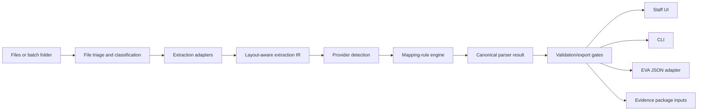

# Parser MVP Implementation Plan

Date: 2026-05-23

Status: active implementation plan. When implemented, move this plan to `archive/plans/implemented/`, rename it with the implementation date, and add an implemented-state block at the top.

## Objective

Build the first executable MVP inside the Operational Core: a deterministic-first instruction parser with non-technical staff UI and equivalent CLI. The parser must handle the current private corpus and produce reviewed EVA-ready JSON plus Box-ready evidence package inputs.

## Success Criteria

An office user can upload instruction/evidence files, run extraction, review source-linked fields, correct warnings, validate EVA export gates, set image preview ordering, export EVA JSON, and generate the evidence-package manifest. An automation user can perform equivalent actions through the CLI using the same parser core.

## Scope

In scope:

- file triage and document classification;
- PDF, DOCX, legacy DOC, MSG, EML, images, and batch folders;
- provider detection and mapping-rule engine;
- all 26 current provider presets;
- canonical parser result with provenance/confidence/warnings;
- UI and CLI parity;
- EVA JSON export gate and field order;
- image package ordering rules;
- private corpus golden tests.

Out of scope for parser MVP:

- live Box upload;
- direct Sentry/EVA submission;
- autonomous Outlook intake;
- autonomous WhatsApp or email sending;
- valuation automation;
- out of scope: personal injury or KADOE workflows;
- cloud document intelligence as default runtime.

## Provider Preset Coverage

Golden tests must cover the current 26 presets:

`ALISON`, `ALS`, `AMS`, `AX`, `BC`, `BLACK`, `CNX (Engineers)`, `DFD`, `EVA (Engineers)`, `FW (Garage)`, `FW (Solicitor)`, `HDUK`, `KBS`, `KERR`, `KMR`, `MP (Branded)`, `MP (Simple)`, `OAK`, `PCH (Lawshield)`, `PCH (Performance)`, `QCL`, `QDOS`, `RJS`, `SBL`, `SWAN`, `TEN`.

Known uncovered or anomalous job-sheet principals requiring triage before parity claims: `ACSP`, `OAK/AX`, `PRINCIPAL`, `WOODLANDS`.

## Architecture

The UI and CLI must call shared parser, validation, export, and package services. They must not duplicate extraction logic.

## File Triage And Classification

Tasks:

1. Detect file type by extension and content signature where practical.
2. Classify each item as instruction, email, evidence image, image pack, valuation/companion report, note, unknown, or mixed batch.
3. For batch folders, build a manifest preserving original paths, hashes, inferred roles, and warnings.
4. Extract attachments from MSG/EML without losing the original email source.
5. Route unknown or unsupported files to manual review, not silent failure.

Acceptance criteria:

- every source file receives file id, hash, type, role guess, and warning list;
- batch manifests preserve original folder/file structure;
- extraction can proceed partially when one file in a batch fails.

Verification:

- tests for PDF, DOCX, DOC, MSG, EML, image, and mixed batch inputs;
- malformed/unsupported file test creates a review warning.

## Extraction Adapter Plan

### PDF Cascade

1. PyMuPDF geometry/text extraction first.
2. pdfplumber table/layout fallback where table or line geometry is needed.
3. pypdf text fallback for simple extraction or PyMuPDF failure.
4. OCR only where justified by scan detection, missing native text, image-only pages, or explicit operator action.

Rules:

- do not OCR every PDF;
- do not reduce layout-rich PDFs to plain text before geometry/table passes;
- preserve page number, block order, text span, bbox, method, and confidence where available.

### DOCX

- Use `python-docx` plus direct OOXML inspection where needed.
- Preserve paragraphs, tables, headers/footers if provider examples require them.
- Convert extracted structure into the shared adapter IR.

### Legacy DOC

- Prefer Microsoft Word automation on staff Windows machines where available.
- Use LibreOffice headless conversion only as a fallback/service/CI conversion path, not as a business workflow dependency.
- Preserve original DOC and record conversion method/hash of converted derivative.

### MSG/EML

- Parse sender, recipients, subject, body, date, and attachments.
- Preserve original email file.
- Treat body text as an instruction candidate when provider rules say instructions arrive in email body.
- Attachments must be routed through the normal triage path.

### Images

- Record file metadata, dimensions, hash, and candidate role.
- OCR is optional/fallback for image-only instructions or visible text checks.
- Damage/preview classification remains review-assisted in MVP unless deterministic evidence is strong.

## Provider Detection And Mapping Engine

The engine must support legacy CE Document Mapper method concepts:

- manual input;
- single label;
- two labels;
- single label with offset;
- regex extraction;
- provider-specific transforms;
- engineer-report detection;
- address block extraction;
- image/evidence flags.

Known legacy behaviours from `collisionrelateddocs/claudechat.md` and normalized companions must be captured before implementation changes:

- work provider/principal is required for export;
- dates must export as `DD/MM/YYYY`;
- inspection address must support six-line handling without silently dropping data;
- mileage, VAT, and mileage unit constraints must produce warnings/export blocks;
- EVA JSON field order must match `Final Format Example 02.json`;
- image ordering requires two preview images followed by all images including the previews again;
- BEL/control-character cleanup must be preserved where legacy output depended on it;
- blank-line offset skipping and label offset behaviours must be tested before modification;
- engineer report overwrites should not overwrite non-blank reviewed fields without a warning.

## Validation And Export Gates

Critical blockers:

- missing work provider/principal;
- invalid EVA date format;
- missing inspection address without image-based assessment marker;
- unresolved provider mismatch;
- unresolved required client/reference fields for that provider;
- unresolved image ordering decision where package includes images.

Warnings:

- low provider confidence;
- multiple candidate values;
- mileage estimated rather than extracted;
- VAT status missing where provider requires it;
- OCR/fallback extraction used;
- unknown attachment type.

EVA export:

- uses canonical parser result after review;
- preserves `Final Format Example 02.json` field order;
- stores source/audit metadata outside EVA payload when unsupported by EVA;
- rejects export when critical blockers remain.

## Staff UI Requirements

Screens:

1. Upload/batch intake.
2. Work item detail.
3. Source preview and extracted fields.
4. Warning/review panel.
5. Provider selection/admin link.
6. Image ordering panel.
7. EVA JSON preview/export.
8. Evidence package preview.

Controls:

- file picker and drag/drop;
- field correction inputs;
- provider dropdown/search;
- warning resolve/override actions with reason;
- image thumbnails with preview slots;
- export/package buttons disabled until gates pass.

Accessibility and operations:

- show source evidence for each extracted field where available;
- keep error messages actionable;
- support re-run parser after config changes without losing previous reviewed result;
- preserve audit identity for corrections.

## CLI Requirements

Required commands:

- `ccc-parser triage <path>`;
- `ccc-parser parse <path> --provider <optional>`;
- `ccc-parser validate <result.json>`;
- `ccc-parser export-eva <result.json>`;
- `ccc-parser package <work-item-or-result>`;
- `ccc-parser batch <folder>`;
- `ccc-parser providers list`;
- `ccc-parser providers validate <config>`;

CLI output:

- JSON by default for automation;
- human-readable summary option;
- non-zero exit codes for validation/export blockers;
- sidecar warnings and provenance files for batch runs.

Parity rule:

- every UI parser/export/package action must call the same service boundary available to CLI.

## Test Strategy

### Golden Corpus Tests

- Use private real corpus only as authoritative parity source.
- Cover all 26 provider presets.
- Store expected canonical parser result snapshots.
- Store expected EVA export snapshots where provider examples have enough fields.
- Add review-required expected outputs for partial or poor-quality cases.

### Adapter Tests

- PDF native text;
- PDF table-heavy;
- PDF scanned/image-only;
- DOCX paragraph/table;
- legacy DOC conversion;
- MSG with body instruction;
- MSG/EML with attachments;
- image-only evidence;
- mixed batch folder.

### Validation Tests

- missing principal;
- date not `DD/MM/YYYY`;
- six-line inspection address;
- missing mileage/VAT/unit;
- provider mismatch;
- image-order blocker;
- EVA JSON field order.

### UI/CLI Parity Tests

- same input produces same canonical result through UI service and CLI command;
- same validation warnings;
- same EVA export payload;
- same package manifest.

## Implementation Sequence

1. Lock contracts and test harness shape.
2. Implement file manifest and triage.
3. Implement adapter IR and PDF cascade.
4. Implement DOCX/DOC/MSG/EML/image adapters.
5. Port provider presets into versioned config model.
6. Implement provider detection and mapping engine.
7. Implement canonical parser result and validation gates.
8. Implement EVA export adapter.
9. Implement CLI parity.
10. Implement staff UI workflow.
11. Implement package manifest and image ordering.
12. Run private corpus golden tests, fix provider gaps, document unresolved cases.

## Verification Gates Before MVP Acceptance

- all required docs and contracts pass scaffold verification;
- corpus regression covers 26 provider presets;
- UI/CLI parity checklist passes;
- EVA JSON field-order tests pass;
- image package ordering tests pass;
- parser keeps personal injury and KADOE out of scope;
- cloud OCR/document intelligence remains feature-flagged/off by default;
- unresolved provider gaps are documented in provider matrix and backlog.
