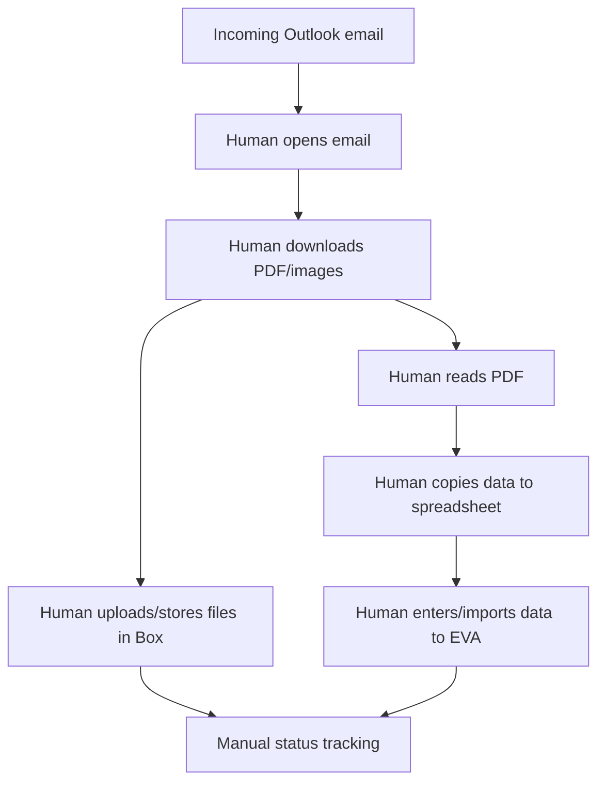

# Current State and Manual Process

## Confirmed current workflow

The current process is understood as follows:

1. Collision Engineers receives emails in Outlook.
2. Emails contain one or more PDF files.
3. Images may be attached to the same email, or may arrive in a separate email.
4. A human opens and reads the PDF.
5. The human identifies required data fields.
6. The human records those fields in a spreadsheet.
7. The human stores/uploads the file into Box.
8. The human manually adds the data into EVA or prepares it for EVA.

## Current process diagram



## Manual decisions currently hidden inside the process

The current human process likely includes judgement that is not yet formalised. These decisions should be discovered and converted into rules, review steps, or exception categories.

Examples:

- Which emails are relevant and which are noise?
- Which PDF is the primary document when multiple PDFs are attached?
- How are related images matched to the correct PDF/case when they arrive separately?
- Which fields are mandatory before entry into EVA?
- Which fields are optional?
- What happens if the PDF contains conflicting data?
- What naming convention is used in Box?
- What should happen when an email has no attachment?
- What should happen when the PDF is a scan and text is not selectable?
- What should happen when data is illegible?
- How are duplicates detected?
- Who reviews exceptions?
- How are corrections tracked?

## Pain points created by the current process

### Re-keying risk

Manual reading and data entry increases the chance of typos, missed fields, inconsistent formatting, and transcription errors.

### Low throughput ceiling

Every additional email adds human effort. Throughput is limited by staff availability and process complexity.

### Inconsistent file handling

Manual Box uploads can produce inconsistent folder paths, filenames, versioning, or metadata.

### Weak auditability

Unless the spreadsheet is carefully maintained, it may be difficult to trace a record from the original email to the PDF, Box file, spreadsheet row, and EVA import result.

### Hard-to-measure exceptions

When staff solve edge cases manually, the organisation may not know how many cases fail automation-style rules or which document patterns cause the most effort.

## Automation opportunity

The process is suitable for automation because it has repeated inputs, repeated destinations, and a clear data-entry burden. It should not be automated as a single opaque step. It should be decomposed into deterministic stages:

1. Intake.
2. File capture.
3. Correlation.
4. Storage.
5. Extraction.
6. Validation.
7. Human review where needed.
8. EVA import.
9. Audit and monitoring.

## Minimum process data to capture during discovery

Before implementation, capture real examples for at least:

- Common PDF templates.
- Scanned PDFs.
- Emails where images arrive separately.
- Emails with multiple attachments.
- Duplicate or forwarded emails.
- Failed or ambiguous manual cases.
- The existing spreadsheet columns.
- The exact EVA fields currently populated by staff.
- Box folder naming and permission expectations.

## Recommended discovery artefact

Create a sample corpus folder with anonymised or permission-cleared examples:

```text
sample_corpus/
  template_A/
    email.eml
    source.pdf
    images/
    expected_extraction.json
    expected_spreadsheet_row.csv
    expected_eva_payload.json
  template_B_scan/
    email.eml
    source.pdf
    expected_extraction.json
```

This sample corpus becomes the foundation for automated tests and extraction quality measurement.
