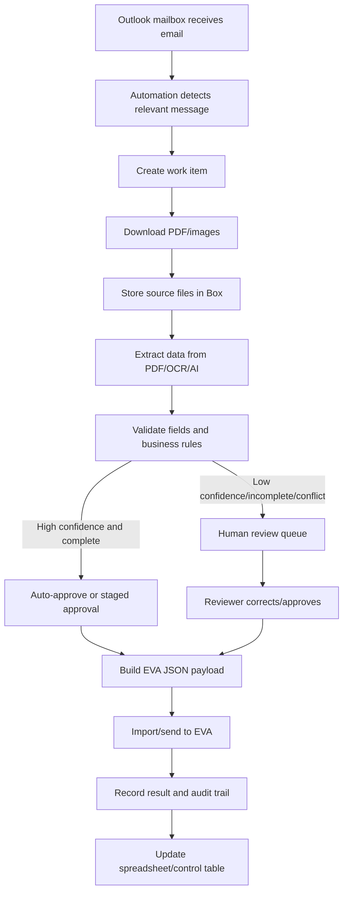

# Target Operating Model

## Target workflow summary

The target operating model is an automated pipeline with human review only where needed. The pipeline should preserve source files, extract structured data, validate that data, and push approved records into EVA.

## Operating model layers

### 1. Intake layer

Receives and classifies Outlook emails. It should avoid processing every email blindly. It should use mailbox folder, sender, subject, attachment type, or configured rules to identify candidate emails.

### 2. Work item layer

Creates one internal work item per case/intake. A work item is the automation’s internal unit of control. It should not rely solely on an Outlook message ID because email IDs can change under some mailbox operations. A work item should have its own stable ID.

### 3. File layer

Stores original PDFs and images in Box. Source files should never be overwritten by extracted data. The original evidence file is the source of truth for audit.

### 4. Extraction layer

Reads PDFs and images and produces structured data. It may combine deterministic PDF text extraction, OCR, template-specific parsing, and AI extraction.

### 5. Validation layer

Checks extracted data against required fields, expected formats, duplicate rules, and EVA constraints. Validation should be explicit and logged.

### 6. Review layer

Allows staff to correct, approve, or reject extracted records. This is the safety valve for automation.

### 7. EVA integration layer

Transforms approved internal data into the exact JSON/API shape accepted by EVA.

### 8. Observability layer

Tracks status, failures, retry counts, timings, and throughput.

## Recommended work item statuses

| Status | Meaning |
|---|---|
| `received` | Relevant email detected and work item created. |
| `awaiting_related_files` | PDF received but expected images or related email may still be pending. |
| `files_stored` | Source files uploaded to Box. |
| `extraction_started` | Extraction job running. |
| `extracted` | Structured data created. |
| `validation_failed` | Data failed rules and needs review or correction. |
| `needs_review` | Human review required. |
| `reviewed` | Reviewer corrected/approved record. |
| `ready_for_eva` | Payload can be sent/imported to EVA. |
| `eva_submitted` | EVA import/API call attempted. |
| `eva_imported` | EVA accepted the record. |
| `failed_retryable` | Temporary failure, retry allowed. |
| `failed_terminal` | Permanent failure, human intervention required. |
| `archived` | Processing complete and retained according to policy. |

## Human role in the target model

The human role shifts from primary data entry to exception review and quality control. Staff should focus on:

- Correcting low-confidence fields.
- Resolving duplicate or related-email ambiguity.
- Approving cases before EVA import where required.
- Reviewing import failures.
- Maintaining template rules and field mappings.

## Automation rate expectations

The first realistic objective should be partial automation with measured confidence, not immediate full autopilot. A sensible progression is:

1. Automate file capture and Box storage first.
2. Add extraction with human review.
3. Add controlled EVA import for reviewed records.
4. Expand auto-approval once extraction performance is measured.

## Recommended control table

Even if the current spreadsheet remains initially, it should become a control/status table rather than the primary manual data-entry surface. Over time, it may be replaced by a database-backed queue or lightweight internal UI.

Minimum columns:

- Work item ID.
- Received date/time.
- Sender.
- Email subject.
- Outlook message ID / internet message ID.
- Case/reference number if extracted.
- Box folder link or ID.
- Source PDF file ID.
- Related image file IDs.
- Extraction status.
- Validation status.
- Review status.
- EVA status.
- Last error.
- Assigned reviewer.
- Last updated.

## Operating principle

The target model should make every item observable. A document should never be in an unknown state. If it cannot be processed automatically, the system should clearly say why and what human action is needed.
