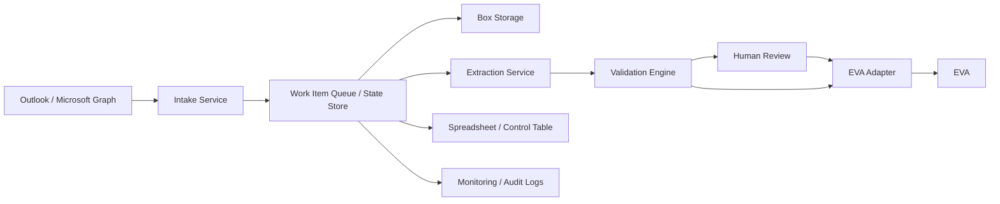

# Systems and Integration Context

## Confirmed systems

| System | Confirmed role |
|---|---|
| Outlook | Receives emails containing PDFs and sometimes images. |
| Box | Stores files received by email. |
| EVA | Niche system where extracted data must be entered/imported. It can accept JSON imports and may expose an API. |
| Spreadsheet | Current manual data capture and tracking surface. |

## Outlook / Microsoft Graph

Recommended integration path: Microsoft Graph.

Microsoft Graph supports authorised access to Outlook mail data in Microsoft 365 mailboxes, including primary mailboxes and shared mailboxes, subject to appropriate permissions. It also supports subscriptions/change notifications for message resources, which can be used to detect new or changed emails without constant polling.

Practical implications:

- Use an app registration with least-privilege mail permissions.
- Decide whether the mailbox is a user mailbox or shared mailbox.
- Use folder-level rules where possible to reduce noise.
- Store stable internal work item IDs rather than relying entirely on Outlook message IDs.
- Capture the internet message ID, sender, subject, received date/time, and attachment metadata.

## Box

Recommended integration path: Box API.

Box supports API-based file/folder operations, webhooks, metadata templates, and structured AI extraction features depending on account licensing and feature availability.

Practical implications:

- Use a service account or app user model if appropriate.
- Define a deterministic folder structure.
- Apply metadata to files/folders so records can be searched and audited.
- Use Box webhooks only when the workflow needs to react to Box-side events. For the first pipeline, Outlook-triggered intake may be sufficient.
- Verify whether Box AI extraction is licensed/allowed before designing around it.

## EVA

Known facts:

- EVA is a niche system.
- EVA can accept JSON imports.
- EVA may support API integration.

Unknowns:

- Does EVA provide a REST API, file import, SFTP import, or manual upload only?
- What authentication model does EVA use?
- What fields are required?
- Does EVA provide validation errors in machine-readable form?
- Can EVA create records and update records, or only create/import?
- Does EVA support idempotency keys or duplicate detection?
- Does EVA expose a sandbox/test environment?

Design implication: create an internal canonical JSON model first, then write an EVA adapter that transforms the canonical model into the specific EVA format.

## Spreadsheet/control layer

The spreadsheet is currently part of the manual process. It can remain during the first phase as a familiar operational view, but it should not be the only database for stateful automation if reliability matters.

Recommended path:

1. Preserve the spreadsheet temporarily for visibility and business continuity.
2. Add a proper work-item state store for automation status and audit.
3. Eventually convert the spreadsheet into a read-only export, dashboard, or reviewer input surface.

## Integration architecture

## Recommended integration style

Use an event-driven state machine rather than a single long-running script. Each stage should be retryable and idempotent.

Plain-English explanation: **idempotent** means that running the same step twice should not create duplicate records or corrupt data. For example, uploading the same file twice should either detect that it already exists or store it as the same work item, not create two unrelated cases.

## Source references

## Source references checked on 2026-05-22

The documents below use these official/public sources where vendor-specific behaviour matters:

- Microsoft Graph Outlook Mail API overview: https://learn.microsoft.com/en-us/graph/api/resources/mail-api-overview?view=graph-rest-1.0
- Microsoft Graph create subscription/change notification API: https://learn.microsoft.com/en-us/graph/api/subscription-post-subscriptions?view=graph-rest-1.0
- Microsoft Graph Outlook change notifications overview: https://learn.microsoft.com/en-us/graph/outlook-change-notifications-overview
- Box Webhooks overview: https://developer.box.com/guides/webhooks
- Box V2 Webhooks: https://developer.box.com/guides/webhooks/v2
- Box metadata instances: https://developer.box.com/guides/metadata/instances/create
- Box AI Extract Structured API: https://developer.box.com/reference/post-ai-extract-structured
- ICO UK GDPR data protection principles: https://ico.org.uk/for-organisations/uk-gdpr-guidance-and-resources/data-protection-principles/a-guide-to-the-data-protection-principles/
- ICO personal data guidance: https://ico.org.uk/for-organisations/uk-gdpr-guidance-and-resources/personal-information-what-is-it/what-is-personal-data/what-is-personal-data/
- ICO personal data breach guide: https://ico.org.uk/for-organisations/report-a-breach/personal-data-breach/personal-data-breaches-a-guide/
