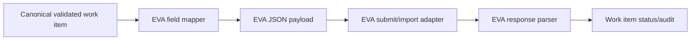

# EVA Integration

## Confirmed context

EVA is a niche business system used by Collision Engineers. It can accept JSON imports and may support API integration.

## Core integration principle

Do not bind extraction logic directly to EVA’s final import format. Use a canonical internal data model first, then map that model into the EVA JSON/API contract.

This protects the project from changes in EVA and allows the extraction pipeline to be tested independently.

## Integration modes to verify

### 1. Direct API

The preferred option if EVA supports it.

Questions:

- Is the API REST, SOAP, GraphQL, or another protocol?
- What authentication does it use: API key, OAuth, basic auth, client certificate, IP allowlist?
- Does it support create, update, search, and attachment upload?
- Does it return machine-readable validation errors?
- Is there a sandbox environment?
- What are rate limits?
- Is there an idempotency key or external reference field?

### 2. JSON file import

Likely viable because JSON imports are known to be supported.

Questions:

- How is the file submitted: UI upload, watched folder, SFTP, email, API endpoint?
- Does EVA import one record per JSON file or many records per batch?
- What naming convention is expected?
- What schema/version is expected?
- How are validation errors returned?
- Can imports be retried safely?

### 3. Robotic/browser automation

Fallback only. If EVA has no usable API or file import automation path, browser automation may be considered.

Risks:

- Brittle UI selectors.
- Harder audit.
- Harder error handling.
- Greater maintenance overhead.
- Potential licensing/support issues.

## Recommended EVA adapter boundary

Create a dedicated adapter with a single responsibility: transform approved canonical data into EVA’s accepted format and submit it.



## Suggested internal interface

```typescript
interface EvaAdapter {
  buildPayload(workItem: CanonicalWorkItem): EvaPayload;
  validatePayload(payload: EvaPayload): EvaValidationResult;
  submit(payload: EvaPayload, options: SubmitOptions): EvaSubmitResult;
  getImportStatus?(externalReference: string): EvaImportStatus;
}
```

## Idempotency

The EVA integration must prevent duplicate records. Use an idempotency key where possible.

Recommended key:

```text
collision:<work_item_id>:<payload_version>
```

If EVA has a customer/reference field suitable for duplicate prevention, store the work item ID or external reference there. If EVA does not support idempotency, the adapter should search/check before creating records, or require human confirmation on retry.

## Payload versioning

Every EVA payload should include or be linked to:

- Canonical schema version.
- EVA mapping version.
- Work item ID.
- Source document IDs.
- Timestamp generated.
- Reviewer ID if human-approved.

Example:

```json
{
  "integration_metadata": {
    "work_item_id": "WI-20260522-000123",
    "canonical_schema_version": "1.0.0",
    "eva_mapping_version": "eva-map-2026-05-22",
    "source_system": "collision-automation-centre",
    "source_box_folder_id": "123456789",
    "generated_at": "2026-05-22T10:25:00Z"
  },
  "case": {
    "reference": "TBC",
    "received_date": "2026-05-22"
  }
}
```

## EVA error categories

| Error category | Example | Handling |
|---|---|---|
| Authentication | Token invalid | Stop, alert technical owner. |
| Authorisation | Service account lacks permission | Stop, alert admin. |
| Schema validation | Missing required field | Send to human review/mapping fix. |
| Business validation | Duplicate case/reference | Link or review before retry. |
| Temporary platform failure | Timeout/503 | Retry with backoff. |
| Unknown response | Non-machine-readable import result | Human review and adapter hardening. |

## Import result storage

Store every submitted payload and response:

```text
workitem_<id>/eva/
  eva_payload_v1.json
  eva_response_v1.json
  eva_submission_log.jsonl
```

This is essential for audit and debugging.

## Open EVA questions

- Exact EVA JSON schema.
- Required vs optional fields.
- Accepted date formats.
- Accepted enum values.
- Whether attachments/images must also be sent to EVA or only linked in Box.
- Whether EVA can store a Box link.
- Whether EVA has a unique external reference field.
- Whether EVA supports partial updates.
- Whether EVA provides test/sandbox access.
- Who owns the EVA vendor relationship and technical documentation.

## Recommended first EVA milestone

Before building the full pipeline, obtain one real or representative PDF and manually construct the desired EVA JSON payload. Submit it to a test/sandbox EVA environment, or through the existing import mechanism, and document the exact accepted schema.
