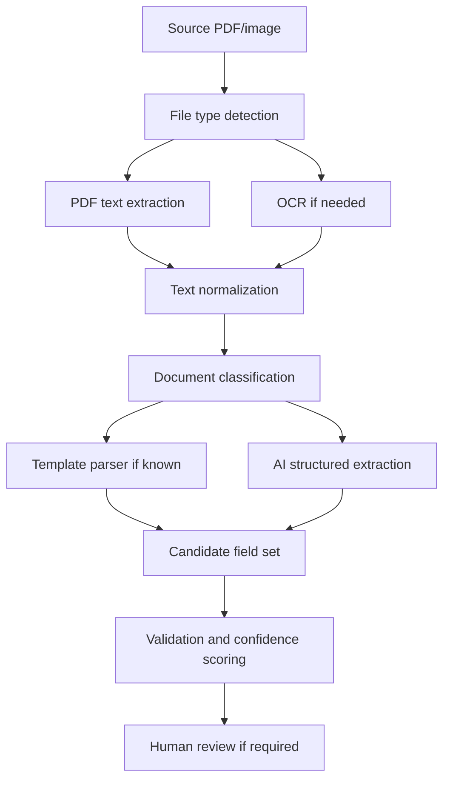

# Data Extraction and AI Strategy

## Purpose

Convert PDFs and related images into structured fields that can be validated, reviewed, stored, and imported into EVA.

## Plain-English explanation

The system needs to “read” documents in a way that software can use. A PDF may contain selectable text, scanned images of text, tables, handwritten notes, or inconsistent layouts. Extraction is the process of turning that source document into a structured JSON object such as `case_reference`, `vehicle_registration`, `customer_name`, and `inspection_date`.

## Extraction approaches

### 1. Direct PDF text extraction

Use this when the PDF contains embedded selectable text.

Advantages:

- Fast.
- Low cost.
- More deterministic.
- Often more accurate than OCR for text-based PDFs.

Limitations:

- Does not work well for scanned documents.
- Table/layout order can be inconsistent.
- Does not understand ambiguous business context by itself.

### 2. OCR

OCR means optical character recognition. It converts an image of text into machine-readable text.

Use OCR when:

- PDFs are scanned.
- Images contain relevant text.
- The PDF text layer is missing or poor quality.

Limitations:

- Can misread characters, especially reference numbers and vehicle registrations.
- Quality depends on scan resolution, rotation, blur, lighting, and handwriting.
- Requires validation and confidence scoring.

### 3. Template/rule-based parsing

Use rules when the document layout is stable.

Examples:

- Regex for reference numbers.
- Known label/value pairs.
- Table extraction for fixed forms.
- Supplier-specific parsers.

Advantages:

- Explainable.
- Cheap.
- Reliable when templates are stable.

Limitations:

- Breaks when templates change.
- Requires maintenance per supplier/document type.

### 4. LLM/AI extraction

An LLM is a large language model. In simple terms, it is software that can read text and infer structure from it. It is useful when documents vary and strict rules are too brittle.

Use AI extraction for:

- Variable layouts.
- Field inference from natural language.
- Summaries or notes.
- Cross-checking fields from different parts of the document.

Limitations:

- It can make mistakes.
- It can infer too much unless constrained.
- It must be forced to return structured JSON.
- It should not be trusted without validation for critical fields.

## Recommended extraction pipeline



## Extraction output design

The extraction service should output three layers:

### Raw extraction

The unmodified text/OCR output and model response.

### Normalized extraction

Cleaned fields in canonical form.

### Evidence map

Pointers showing where each field came from.

Example:

```json
{
  "field": "vehicle_registration",
  "value": "AB12CDE",
  "confidence": 0.94,
  "source": {
    "file_id": "box_file_123",
    "page": 1,
    "text_snippet": "Vehicle Reg: AB12CDE",
    "method": "pdf_text_plus_regex"
  }
}
```

## Confidence scoring

Confidence should not be a vague single number from an AI model. It should combine signals:

- Was the field found by deterministic parsing?
- Was it found in multiple places consistently?
- Did OCR report high confidence?
- Does it match expected format?
- Is it required by EVA?
- Did an AI model produce a valid schema without repair?
- Does it contradict any other field?

## Recommended field status values

| Status | Meaning |
|---|---|
| `accepted` | Field passed validation and confidence threshold. |
| `needs_review` | Field exists but confidence or validation is insufficient. |
| `missing` | Required field not found. |
| `conflict` | Multiple candidate values disagree. |
| `not_applicable` | Field is not required for this document/case type. |
| `rejected` | Value failed validation. |

## Human review threshold

A record should require human review when:

- Any EVA-required field is missing.
- A critical field has low confidence.
- A critical field conflicts across sources.
- The document type is unknown.
- The email/image correlation is uncertain.
- The PDF is unreadable or OCR confidence is poor.
- The extracted data suggests a duplicate case.
- The EVA payload fails pre-validation.

## Suggested critical fields

Exact fields must be confirmed from the spreadsheet and EVA schema, but likely critical categories include:

- Case/reference number.
- Customer/claimant/client details.
- Vehicle details.
- Incident or inspection date.
- Location.
- Supplier/insurer/solicitor/reference details.
- Required operational notes.
- Attachments/images/evidence references.

## Prompting strategy for AI extraction

When using an LLM, constrain it tightly:

- Provide a JSON schema.
- Tell it not to invent missing values.
- Require `null` for missing fields.
- Require confidence and evidence for each field.
- Require page references where possible.
- Validate output against the schema.
- Reject or repair invalid JSON only in a controlled way.

Example instruction shape:

```text
Extract only the fields defined in the schema. Do not guess. If a field is not present, return null. For every field, include confidence, source page, and evidence text. Return valid JSON only.
```

## Evaluation metrics

Track extraction quality by field, not just by document.

| Metric | Meaning |
|---|---|
| Field precision | When the system extracts a value, how often is it correct? |
| Field recall | How often does the system find a value when it exists? |
| Critical-field accuracy | Accuracy for fields required by EVA. |
| Auto-approval rate | Percentage of records that need no human review. |
| Review correction rate | How often reviewers change extracted fields. |
| False auto-approval rate | Records incorrectly approved automatically. This should be near zero. |

## Recommended first extraction milestone

Use a labelled sample set of real documents. For each document, create an expected JSON output manually. Then run extraction and compare field-by-field.

Initial goal:

- High automation for file capture.
- Measured extraction for all fields.
- Human review for EVA submission.
- Gradual auto-approval only after enough evidence.
