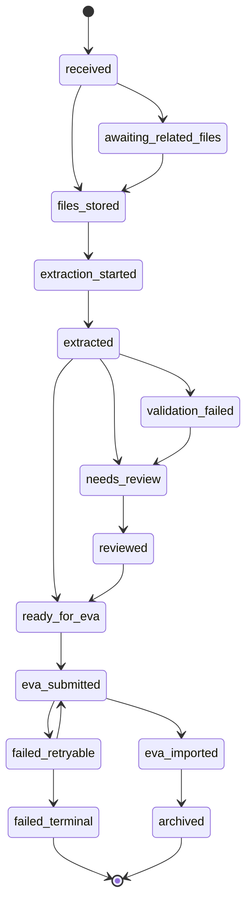

# Workflow States and Orchestration

## Purpose

Define how the automation moves work items through the process reliably, with retries, idempotency, and auditability.

## Recommended architecture

Use a state machine backed by a durable store. Each stage reads a work item in one state, performs a small action, writes an event, and moves the work item to the next state.

Plain-English explanation: a **state machine** is a controlled checklist where every item has one current status, and only allowed transitions can happen. It prevents items from silently jumping from “email received” to “imported” without evidence of the steps in between.

## State transition model



## Suggested work item table

| Column | Purpose |
|---|---|
| `work_item_id` | Stable internal ID. |
| `status` | Current state. |
| `created_at` | First created timestamp. |
| `updated_at` | Last update timestamp. |
| `source_email_id` | Outlook/Graph message ID. |
| `internet_message_id` | Email-level dedupe signal. |
| `box_folder_id` | Box folder for source and outputs. |
| `case_reference` | Extracted or assigned case reference. |
| `extraction_confidence` | Overall confidence. |
| `review_required` | Boolean. |
| `eva_status` | EVA import state. |
| `retry_count` | Technical retries. |
| `last_error_code` | Machine-readable error. |
| `last_error_message` | Human-readable error. |

## Queue design

Each stage can be implemented as a queue worker or scheduled job:

- `intake_worker`
- `file_storage_worker`
- `correlation_worker`
- `extraction_worker`
- `validation_worker`
- `review_sync_worker`
- `eva_submission_worker`
- `reconciliation_worker`

## Idempotency rules by stage

| Stage | Idempotency rule |
|---|---|
| Email intake | Same internet message ID + attachment checksum should not create duplicate work item. |
| Box storage | Same work item + checksum should not upload duplicate source file. |
| Extraction | Same document version + extraction version can reuse previous extraction. |
| Review | Corrections should create a new review version, not mutate history silently. |
| EVA import | Same work item + payload version should not create duplicate EVA record. |

## Retry strategy

Use retry only for temporary failures.

Retryable examples:

- Network timeout.
- Temporary API rate limit.
- Service unavailable.
- Token refresh transient issue.

Non-retryable examples:

- Invalid EVA schema.
- Missing required field.
- Unsupported file type.
- Permission denied due to service account configuration.

## Backoff policy

Suggested policy:

```text
attempt 1: immediate
attempt 2: +1 minute
attempt 3: +5 minutes
attempt 4: +30 minutes
attempt 5: mark failed_retryable or failed_terminal depending on error
```

## Reconciliation jobs

Reconciliation catches missed states and drift.

Examples:

- Compare processed Outlook emails to work item records.
- Compare Box folder contents to document records.
- Check work items stuck in `extraction_started` beyond a threshold.
- Check EVA submissions without final result.
- Check unmatched image emails older than the correlation window.

## Audit events

Every meaningful transition should write an immutable event:

- Email detected.
- Attachment downloaded.
- Box folder created.
- File uploaded.
- Extraction completed.
- Validation failed.
- Human review started.
- Human review approved.
- EVA payload generated.
- EVA import submitted.
- EVA import succeeded/failed.

## Configuration management

Avoid hard-coding business logic. Use configuration for:

- Monitored mailboxes/folders.
- Sender allowlists.
- Subject patterns.
- Correlation windows.
- Box root folder IDs.
- Required fields.
- Confidence thresholds.
- EVA endpoint/import settings.
- Retry limits.

## Recommended environment separation

Use at least:

- Development.
- Test/sandbox.
- Production.

Do not test extraction or EVA submission against live production data without clear controls.

## Failure visibility

A failed work item must be visible to operations. Silent failure is worse than manual processing because staff may assume automation handled it.

Minimum dashboard categories:

- New received today.
- Successfully imported today.
- Awaiting related files.
- Needs review.
- Failed retryable.
- Failed terminal.
- Unmatched images.
- Average processing time.
