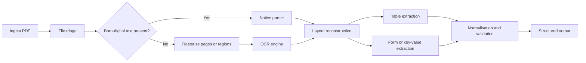
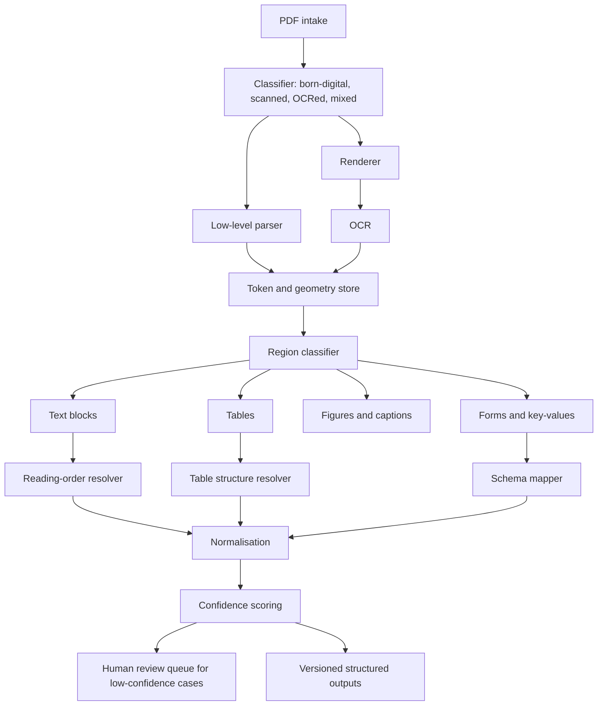

# PDF Extraction from PDFs

## Executive summary

PDF extraction is hard for a structural reason: PDF was designed primarily to preserve *appearance* across devices and printers, not to preserve the human meaning of a document in the way a word-processing file does. In practice, a PDF is an indexed collection of objects, streams, fonts, encodings, images, and page drawing instructions. That architecture is excellent for faithful rendering, but it often leaves downstream software to *infer* paragraphs, reading order, table boundaries, headings, footnotes, and semantic relationships after the fact. The problem becomes much worse when fonts use custom encodings, when character-to-Unicode mappings are absent or broken, when text is absolutely positioned, and when the document is a scan rather than a born-digital file with embedded text. citeturn29search9turn29search19turn29search2turn31search1turn31search3turn34search0

The most robust extraction systems are therefore **hybrid pipelines** rather than single libraries. For born-digital PDFs, native parsing usually outperforms OCR because parsers can use font, encoding, coordinate, and object information directly. For scans and image-only regions, OCR is essential. For tables, no single method is universally best: rule-based “lattice” methods work well when ruling lines are clear; “stream” methods work better when the structure is implied by alignment; and learned detectors and structure recognisers help with scanned, irregular, or weakly ruled tables. For complex enterprise documents, the strongest production systems typically combine file triage, native parsing, selective rasterisation, OCR, layout analysis, table extraction, and post-processing with validation against schemas or business rules. citeturn34search0turn35search13turn19search0turn20search0turn28search2turn8search18turn8search15

Open-source tooling is very capable, but it is fragmented by document type and failure mode. Apache PDFBox, Poppler, pypdf, pdfminer.six, and PyMuPDF are strong foundations for born-digital PDFs. pdfplumber, Camelot, Tabula, and Excalibur are useful for text-based tables. Tesseract and OCRmyPDF are the main open OCR workhorses. docTR, LayoutLM-style models, Donut, GROBID, and Unstructured sit in the wider “Document AI” layer, where the goal moves from simple text recovery to layout understanding, markup reconstruction, or downstream information extraction. Commercial APIs such as Google Cloud Vision, Amazon Textract, Azure Document Intelligence, and ABBYY package OCR, layout, and structured extraction together, but they bring page-based operating costs, service limits, and data-governance trade-offs. citeturn23search0turn38search0turn21search2turn32search0turn24search7turn19search1turn6search6turn6search7turn19search3turn8search4turn35search0turn10search3turn10search1turn10search2turn27search1turn25view0turn16search3turn8search18turn8search15turn14search2

The current research frontier is not “OCR versus parsing” but **how to combine signals**: text tokens, page images, bounding boxes, graph structure, document metadata, tables, formulas, and even generative multimodal models. Layout-aware transformers such as LayoutLM and LayoutLMv3 showed that text and page geometry should be learned jointly; Donut showed that some document tasks can skip external OCR entirely; graph-based models showed that relations between blocks and tokens can be as important as the tokens themselves. Yet classical parsing is still indispensable, because learned models still depend on reliable inputs, clean supervision, and domain adaptation, and because many real PDF failures are still caused by low-level syntax, encoding, or file-construction issues rather than by missing model capacity. citeturn11search0turn10search1turn10search2turn12search0turn12search2turn12search3

## PDF internals and why extraction is hard

At the file-format level, a PDF has a **header**, a **body** containing indirect objects, a **cross-reference table or cross-reference stream**, and a **trailer** that helps a reader find the document root and navigate object locations. Streams are used for large binary or content data, and they must be indirect objects. Over time, newer PDF revisions added object streams and cross-reference streams, which reduce size and support incremental updates, but also make low-level parsing more complex. In plain English, a PDF is less like a semantic document tree and more like a compact, indexed instruction set for painting pages. citeturn29search9turn29search19turn29search2turn29search0turn29search3

Text extraction depends heavily on **fonts, encodings, and Unicode mappings**. Adobe’s PDF references describe font resources, predefined encodings such as MacRoman and WinAnsi, composite Type 0 fonts with CMaps, and optional **ToUnicode** streams that map character codes to Unicode values. When those mappings are present and correct, extraction is much easier. When they are absent, incomplete, or deliberately obfuscated with scrambled fonts, a parser may recover glyph positions but not the intended characters. That is one of the main reasons why users sometimes see “garbage text” from perfectly viewable PDFs. citeturn31search0turn30search1turn31search1turn31search3turn31search2

**XObjects** are reusable content objects, especially **Image XObjects** and **Form XObjects**. They matter for extraction because a page may contain text drawn directly in content streams, text embedded inside reused form objects, raster images that need OCR, or mixed content where only parts of the page are machine-readable. In other words, “this page looks like text” does not necessarily mean “this page stores text as text.” citeturn30search2turn30search9turn30search7

**Tagged PDF** tries to fix the semantic gap by adding a logical structure layer: headings, lists, table semantics, reading order, alternative text, and other accessibility metadata. That makes extraction, reflow, and accessibility materially easier when tags are correct. But many real-world PDFs are untagged, partially tagged, or tagged inconsistently, so high-quality extraction pipelines cannot rely on tags being present. The PDF Association succinctly notes that without tags a PDF is “just visually positioned text” for assistive technologies. citeturn0search3turn37view0

**PDF/A** is the archival family of PDF standards. The Library of Congress describes PDF/A-1, PDF/A-2, PDF/A-3, and PDF/A-4 as open ISO standards for long-term preservation, with PDF/A-4 based on PDF 2.0. PDF/A generally improves determinism and sustainability by constraining features and requiring stable metadata practices, but it is not a magic fix for semantics: the LoC notes that some logical-structure requirements changed in PDF/A-4, and archival suitability still depends on what information is preserved and what is lost during conversion. PDF/A-3 and PDF/A-4f also allow embedded files, which may help workflows but introduce preservation and extraction complications. citeturn36view0turn36view1turn37view0

The extraction challenges that fall out of this design are predictable. pypdf’s documentation gives a good practical summary: paragraph boundaries are ambiguous, headers and footers may or may not be wanted, tables are often just absolutely positioned text, ligatures complicate character output, formulas and footnotes disrupt reading order, and scanned PDFs store page images rather than native text. Multi-column pages, rotated text, weakly ruled tables, and OCR text layers behind scans add still more ambiguity. This is why “extract text from PDF” is actually a family of separate problems: decoding, ordering, grouping, segmenting, and validating. citeturn33view0turn34search0

One useful practical distinction is between **born-digital PDFs**, **scanned PDFs**, and **OCRed PDFs**. pypdf distinguishes them clearly: born-digital files contain real embedded text; scanned files are essentially image containers; OCRed files are scans with an additional hidden text layer. That distinction should be the *first* branching rule in any extraction system, because it determines whether parsing is sufficient, OCR is necessary, or both should be reconciled. citeturn33view0turn34search0

The specification itself is also easier to access than it used to be. The PDF Association now points developers to the no-cost ISO 32000-2 bundle for PDF 2.0, which is helpful for teams building or debugging low-level parsers. citeturn37view0

## Extraction methods and pipeline design

The core technical split is between **parsing-based** and **rendering-based** extraction.

A **parsing-based** approach reads the PDF’s internal objects directly. It looks at content streams, text-showing operators, font dictionaries, encodings, coordinate systems, and structure metadata. This is the right default for born-digital PDFs because it preserves information that OCR would throw away, such as exact character codes, font references, and geometric layout. pypdf explicitly recommends *not* replacing native extraction with OCR for digitally born files, because parsers can use fonts, encodings, and spacing information that are invisible once the page has been rasterised. pdfminer.six takes the same general stance by extracting text “directly from the sourcecode of the PDF” and exposing exact positions, fonts, and colours. citeturn34search0turn32search1turn32search0

A **rendering-based** approach rasterises a page into pixels and then treats it as an image. That is essential for scans, image-heavy pages, damaged encodings, or OCR-first document AI systems. OCRmyPDF describes its own pipeline this way: rasterise each page, optionally rotate and clean it, run Tesseract OCR, then rebuild a searchable PDF or PDF/A. Cloud APIs for PDF OCR work similarly, even if the rasterisation step is hidden behind the service boundary. citeturn35search13turn35search20turn16search3turn18search0

The best real-world answer is usually a **hybrid pipeline** that treats pages and regions differently:

That pattern is supported by both tool documentation and research. Rule-based tools such as Camelot and pdfplumber work directly on text geometry and lines; OCR pipelines such as OCRmyPDF and Tesseract operate on images; layout-aware models such as LayoutLMv3 take OCR tokens plus geometry; and OCR-free models such as Donut operate directly on page images for selected tasks. citeturn19search0turn20search0turn35search13turn17search15turn10search1turn10search2

On the OCR side, the main approaches differ by how much structure they recover beyond raw text. **Tesseract** is an open-source OCR engine; version 4 introduced an LSTM-based recogniser, and its docs say official language data are available for 100+ languages and 35+ scripts. It is strong when paired with good preprocessing and when you control the pipeline yourself, but its training docs also note a compute trade-off: better neural recognition comes with higher compute requirements. citeturn17search0turn17search15turn8search4

By contrast, **Google Cloud Vision**, **Amazon Textract**, **Azure Document Intelligence**, and **ABBYY** are service or SDK layers that combine OCR with some degree of layout, table, or field extraction. Google Vision supports PDF/TIFF OCR asynchronously and exposes quotas for page counts and in-process pages, but Google’s own OCR guidance says that if you are processing scanned documents and need structured parsing, **Document AI** is the better Google product. Amazon Textract positions itself as more than OCR by extracting text, forms, and tables. Azure Document Intelligence similarly focuses on text, layout, tables, and key-value pairs, with prebuilt and custom models. ABBYY’s developer products emphasise OCR plus PDF conversion and field extraction, but much current pricing is quote-based rather than publicly fixed. citeturn16search3turn18search2turn8search9turn8search18turn8search10turn8search15turn14search4turn14search2

For **layout analysis and document understanding**, there is a spectrum:

Classical systems rely on rules and heuristics: whitespace clustering, XY sorting, line detection, bounding-box overlap, and hand-tuned thresholds. These ideas still drive many strong production table extractors. Camelot’s documented flavours are a concrete example: **lattice** uses ruling lines, **stream** relies on text alignment, **network** is text-based, and **hybrid** combines parsers. pdfplumber’s table detection is explicitly inspired by Anssi Nurminen’s thesis and Tabula’s design. citeturn19search0turn20search0turn19search2

Machine-learning systems add learned segmentation, detection, and relation modelling. **docTR** is a practical OCR library built around a two-stage deep-learning pipeline: text detection first, then recognition. **LayoutLM** introduced joint modelling of text and layout for document intelligence. **LayoutLMv3** extended that with unified text and image masking for self-supervised multimodal pretraining. **LiLT** addressed language transfer by separating layout knowledge from language-specific text models. **PICK** used graph learning on text and visual features for key information extraction. **Donut** showed that some document-understanding tasks can be done *without* external OCR by using an end-to-end Transformer over images. In layman’s terms, the field moved from “read the letters first, reason later” to “learn the letters, layout, and task together.” citeturn10search3turn11search0turn10search1turn12search2turn12search0turn10search2turn28search8

For **table extraction**, the decisive split is between **lattice**, **stream**, and **learned structure recognition**. Lattice methods find ruled lines and cell intersections. Stream methods infer columns and rows from aligned text. pdfplumber uses a Nurminen-inspired detection approach. Microsoft’s **Table Transformer** and the related **PubTables-1M** work showed that transformer-based object detection can perform very well on table detection, structure recognition, and functional analysis, while also introducing the **GriTS** metric. PubTabNet remains important for image-based table recognition and introduced **TEDS**, a tree-edit-distance-based similarity measure for structural evaluation. The practical implication is simple: use rule-based methods first when the document layout is regular and text-based; use learned models when the table structure is visual, noisy, scanned, or irregular. citeturn19search0turn20search0turn28search2turn13search3turn11search1turn13search2

A recommended modular architecture for robust extraction looks like this:

This architecture is deliberately modular because failure modes are modular. A document can have native text on one page, scanned tables on the next, form fields in one area, and vector diagrams elsewhere. A system that insists on one extraction path for the whole file will usually fail on mixed documents. citeturn33view0turn25view0turn35search13turn28search2

## Tooling ecosystem and comparative analysis

A useful way to think about tools is by the layer they solve. Some are **low-level PDF libraries**; some are **table specialists**; some are **OCR engines**; some are **end-to-end document AI systems**. Where official documentation does not publish comparable throughput numbers, the performance notes below are qualitative rather than benchmark-normalised.

**Native PDF libraries and parsers**

| Name | What it is and core technique | Features, inputs, languages | Performance notes and limitations | Licence or cost | Representative link |
|---|---|---|---|---|---|
| Apache PDFBox | Java PDF library for creating, manipulating, and extracting content; parsing-based with command-line tools. | Features include Unicode text extraction, forms, PDF/A preflight, image export, creation, signing; best for born-digital PDFs; language support is effectively whatever is properly encoded/decodable, but no public count is specified. | Mature and broad; good for JVM stacks. It is not an OCR engine, so scanned PDFs require external OCR. | Apache-2.0. | Official site / repo citeturn23search0turn23search6 |
| Poppler | Native C++ rendering library derived from Xpdf; often used through utilities such as `pdftotext`, `pdftohtml`, `pdffonts`, and `pdfimages`. | Strong for rendering, text export, font inspection, image extraction, and PDF utility workflows; works best on born-digital PDFs; language support depends on encoded text and fonts rather than an OCR language list. | Usually fast because it is native code; release notes show continuing performance work and damaged-file reconstruction improvements. It is not an OCR engine. | GPL-family licence in the C++ API headers; open-source. | Official site / release notes / API headers citeturn38search0turn38search1turn22search9turn38search2 |
| pypdf | Pure-Python PDF library; parsing-based, with text extraction plus manipulation features. | Retrieves text and metadata; supports forms and annotations; pure Python makes it easy to embed; best for born-digital PDFs. Language support is not enumerated publicly and depends on decodable text. | Flexible and easy to script. Official docs explicitly warn that text extraction is hard and that scanned/image-only PDFs require OCR. | Open-source, free; official docs describe it as free and open source, with no usage fee. | Official docs / repo citeturn21search2turn21search5turn21search7turn34search0turn21search11 |
| pdfminer.six | Pure-Python parser focused on text analysis from source PDF objects. | Extracts text, images, table of contents, tagged content, coordinates, fonts, and colours; supports PDF 1.7 features, CJK and vertical writing, several font types, and encrypted PDFs; best on born-digital PDFs. | Very strong for detailed text geometry and layout analysis. It is not a full OCR solution, and public issues show annotations are not a strong focus. | MIT-style open-source licensing is standard for the project; the cited docs describe it as community maintained and open source. | Official docs / repo citeturn32search0turn32search1turn32search3turn32search5turn32search6 |
| PyMuPDF and MuPDF | Python bindings over the MuPDF C engine; supports extraction, rendering, conversion, and manipulation. | Exposes text as plain text, blocks, words, HTML-like structured outputs, images, metadata, and more; excellent for born-digital PDFs and for rendering pages before OCR; not a built-in OCR service by default. | Officially described as high-performance and built on a fast C engine. Licensing is important: AGPL for open-source use or a commercial licence. | Dual-licensed: AGPL or commercial. | Official docs / repo / licence pages citeturn24search7turn24search2turn24search3turn24search6turn24search8 |
| pdfplumber | High-level Python library built on pdfminer.six, with table extraction and visual debugging. | Extracts characters, lines, rectangles, words, and tables; supports visual debugging and region cropping; works best on machine-generated PDFs, not scans. Language support follows underlying embedded text. | Very useful when coordinates matter. Table extraction is heuristic, not a universal semantic parser, and scanned files usually need OCR upstream. | MIT-style open-source on GitHub; free. | Official repo / table docs citeturn19search1turn20search0turn32search2 |

**Table extraction tools**

| Name | What it is and core technique | Features, inputs, languages | Performance notes and limitations | Licence or cost | Representative link |
|---|---|---|---|---|---|
| Camelot | Python library specialised for PDF tables. | Supports multiple flavours: stream, lattice, network, and hybrid; exports tables to data formats; intended for text-based PDFs rather than scans. Language support depends on embedded text. | Excellent when tables are regular and the document is born-digital. Weak on scanned/image-only PDFs unless OCR is added beforehand. | MIT-style open-source / free. | Official docs / repo citeturn19search0turn19search4turn6search6 |
| Tabula and tabula-java | Widely used table extraction tool and underlying Java engine. | Best known for CSV/Excel export from text-based PDFs; supports stream and lattice-style extraction concepts; works via GUI and command line. | Very practical for analysts and journalists. Official docs explicitly say it only works on text-based PDFs, not scanned documents. | Free and open-source; tabula-java is MIT. | Official site / repo / engine repo citeturn6search7turn6search11turn19search2turn20search11 |
| Excalibur | Web UI built on Camelot. | Lets users inspect pages, define workspace areas, tweak Camelot settings, and export tables; intended for text-based PDFs. | Good for human-in-the-loop extraction and rapid tuning. Same core limitations as Camelot: not for scans without OCR. | Open-source / free. | Official repo / docs citeturn19search3turn19search12 |

**OCR and intelligent document processing**

| Name | What it is and core technique | Features, inputs, languages | Performance notes and limitations | Licence or cost | Representative link |
|---|---|---|---|---|---|
| Tesseract | Open-source OCR engine; since version 4 it uses an LSTM-based recogniser. | OCR on images and scans; supports 100+ languages out of the box and 35+ scripts according to Tesseract docs; image formats include PNG, JPEG, TIFF; usually paired with preprocessing tools. | Strong foundational OCR with full local control. Training/fine-tuning may need significant compute, and document layout reconstruction is largely up to the surrounding pipeline. | Apache-2.0 / free. | Official docs / repo citeturn17search0turn17search15turn8search4turn8search8 |
| OCRmyPDF | Command-line and Python tool that adds a searchable OCR text layer to scanned PDFs. | Rasterises pages, optionally rotates, deskews, removes background, cleans noise, runs Tesseract, and outputs searchable PDF or PDF/A; works on scanned PDFs and mixed PDFs. | Excellent production wrapper for scan workflows. Not a semantic table or form extractor by itself; quality depends heavily on page quality and Tesseract. | MPL-2.0 / free. | Official docs / repo citeturn35search0turn35search2turn35search3turn35search13turn18search3 |
| Google Cloud Vision | Cloud OCR API with image and PDF/TIFF document text detection. | Asynchronous PDF/TIFF OCR to JSON; many languages with optional language hints; primarily OCR rather than full structured document understanding. | Good managed OCR. For scanned documents requiring form/entity parsing, Google’s own docs recommend Document AI. PDF/TIFF support is asynchronous and quota-limited. | Commercial API; public page-based pricing. | Official docs / pricing / quotas citeturn16search3turn16search2turn18search2turn14search1turn8search9 |
| Amazon Textract | Managed AWS service for OCR plus document analysis. | Extracts text, handwriting, tables, and forms; supports PDFs and images; AWS FAQs list English, Spanish, German, Italian, French, and Portuguese for printed text, with English-only limits for some specialised tasks. | Strong structured extraction out of the box. Asynchronous PDF/TIFF processing has fixed page and size limits; throughput is quota-managed. | Commercial API; page-based pricing. | Official docs / FAQs / pricing / limits citeturn8search18turn8search10turn16search0turn18search0turn8search6 |
| Azure Document Intelligence | Microsoft’s managed OCR and document understanding service, formerly Form Recognizer. | Extracts text, tables, structure, and key-value pairs; supports prebuilt and custom models; accepts PDFs, images, and forms; multilingual support is documented by model and feature. | Strong enterprise option with layout and field extraction. Pricing is page-based and varies by model and region; public pricing pages are partly dynamic, so some exact values are not always visible without marketplace context. | Commercial API; page-based pricing, some details dynamic. | Official overview / language support / pricing / limits citeturn8search15turn14search4turn16search1turn15view0turn18search1 |
| ABBYY FineReader Engine | Commercial OCR SDK and document-processing engine. | Converts scans and TIFF libraries to PDF/PDF/A and office formats and extracts field values; vendor docs expose predefined recognition-language tables; works on Windows, Linux, and Mac according to the product page. | Long-standing commercial OCR stack with broad language and enterprise deployment support. Public fixed pricing is generally not shown on the SDK page; quote-based sales are typical. | Commercial; quote-based or unspecified publicly. | Official SDK / language docs citeturn9search0turn14search2turn9search12 |

**Document AI, layout models, and higher-level pipelines**

| Name | What it is and core technique | Features, inputs, languages | Performance notes and limitations | Licence or cost | Representative link |
|---|---|---|---|---|---|
| docTR | Open-source deep-learning OCR library. | Two-stage OCR: text detection, then text recognition; intended for document images and scanned files; supports model selection and benchmarked architectures. | Strong for custom OCR pipelines and research-to-production prototypes. Language support is vocabulary/model dependent rather than a simple vendor language count. | Apache-2.0 / free. | Official repo / docs / model notes citeturn10search3turn10search10turn26search4turn26search20turn26search0 |
| LayoutLMv3 | Layout-aware multimodal Transformer model family for Document AI. | Uses text, layout, and image information with unified text and image masking; suited to form understanding, receipt understanding, DocVQA, and layout analysis; typically expects OCR tokens and bounding boxes. | Strong research and fine-tuning base for structured understanding. Not a turnkey extractor by itself; requires model integration and usually OCR upstream. | Model and code available through Microsoft and Hugging Face; research/open model usage. | Paper / official code family / model docs citeturn10search1turn28search0turn28search3turn28search4 |
| Donut | OCR-free end-to-end document understanding Transformer. | Swin-style vision encoder plus text decoder; works directly from document images for tasks such as information extraction and document parsing; avoids external OCR error propagation. | Powerful for specific tasks and domains, especially when OCR is brittle. It still requires careful fine-tuning and may not replace low-level parsing for all PDF extraction use cases. | Open-source model/repo. | Paper / official repo / model docs citeturn10search2turn10search6turn28search8turn28search15 |
| GROBID | Machine-learning library for scholarly document parsing. | Extracts and restructures PDFs into TEI/XML; focuses on scientific articles; handles segmentation, sections, references, figures, and tables, and can emit PDF coordinates. | Excellent in its domain. Less suitable as a general-purpose enterprise parser without retraining or pipeline adaptation. | Open-source / free. | Official docs / repo citeturn27search1turn27search2turn27search0turn27search6 |
| Unstructured | Open-source ETL and partitioning library for many document formats. | `partition_pdf` supports strategies such as `fast`, `hi_res`, and `ocr_only`; can infer table structure; depends on extras such as Poppler and Tesseract for some PDF/image workflows. | Useful as a pipeline orchestrator and LLM-ingestion layer. Quality varies by strategy and dependencies; public repo issues show edge cases around table inference. | Apache-2.0 / free for OSS components; enterprise platform sold separately. | Official docs / repo / public issues citeturn25view0turn25view1turn7search9turn7search13 |

Two important **adjacent projects** are worth calling out even though the top-20 table below is capped at 20 entries. Microsoft’s **Table Transformer** repository is the official home for the Table Transformer models, the PubTables-1M dataset, and the GriTS metric, making it a major reference point for learned table extraction. Datalab’s **Marker** is a fast, current open-source document-to-markdown/JSON system with GPU support, hybrid LLM mode, and explicit commercial-usage constraints that differ between code and model weights. citeturn28search2turn13search3turn25view2

**Compact comparative table of top 20 tools, packages, and services**

| Name | Type | Core technique | Tables support | OCR needed | Licence or cost | Link |
|---|---|---|---|---|---|---|
| Apache PDFBox | OSS | PDF parsing and manipulation in Java | Limited native support; not table-specialised | No for born-digital; external OCR for scans | Apache-2.0 | Official docs citeturn23search0turn23search6 |
| Poppler | OSS | Native rendering and text/image utility stack | Limited native support; not table-specialised | No for born-digital; external OCR for scans | GPL-family OSS | Official docs citeturn38search0turn38search2 |
| pypdf | OSS | Pure-Python PDF parsing | Minimal native table semantics | No for born-digital; external OCR for scans | Free and open source | Official docs citeturn21search2turn34search0 |
| pdfminer.six | OSS | Pure-Python parsing with layout analysis | Indirect; table logic usually added upstream/downstream | No for born-digital; external OCR for scans | OSS / free | Official docs citeturn32search0turn32search1 |
| PyMuPDF and MuPDF | OSS/commercial | Native C engine with Python bindings | Limited built-in table semantics | No for born-digital; external OCR optional | AGPL or commercial | Official docs citeturn24search7turn24search6 |
| pdfplumber | OSS | Geometry-aware extraction on pdfminer.six | Yes, heuristic table extraction | No for text PDFs; OCR upstream for scans | OSS / free | Official repo citeturn19search1turn20search0 |
| Camelot | OSS | Lattice, stream, network, hybrid table extraction | Yes | No for text PDFs; yes upstream for scans | OSS / free | Official docs citeturn19search0turn6search6 |
| Tabula | OSS | Text-based table extraction via tabula-java | Yes | No for text PDFs; not for scans | OSS / free | Official site citeturn6search7turn6search11 |
| Excalibur | OSS | Human-in-the-loop UI on Camelot | Yes | No for text PDFs; yes upstream for scans | OSS / free | Official repo citeturn19search3 |
| Tesseract | OSS | OCR with LSTM recogniser | Indirect only; not a table parser | Yes | Apache-2.0 | Official docs citeturn17search0turn8search8 |
| OCRmyPDF | OSS | Rasterise, preprocess, OCR, rebuild searchable PDF | Indirect only; not table-specialised | Yes, built-in via Tesseract | MPL-2.0 | Official docs citeturn35search0turn35search3 |
| Google Cloud Vision | Commercial API | Cloud OCR on images and PDFs | Limited structure compared with full IDP | Built-in OCR | Page-based commercial pricing | Official docs citeturn16search3turn14search1 |
| Amazon Textract | Commercial API | OCR plus form and table extraction | Yes | Built-in OCR | Page-based commercial pricing | Official docs citeturn8search18turn8search6 |
| Azure Document Intelligence | Commercial API | OCR plus layout, tables, key-values, custom models | Yes | Built-in OCR | Page-based commercial pricing | Official docs citeturn8search15turn15view0 |
| ABBYY FineReader Engine | Commercial SDK | OCR, conversion, field extraction | Yes, depending on configuration | Built-in OCR | Commercial, quote-based | Official vendor page citeturn9search0turn14search2 |
| docTR | OSS | Deep-learning text detection and recognition | Limited indirect support | Built-in OCR | Apache-2.0 | Official repo citeturn10search3turn26search4 |
| LayoutLMv3 | Model / OSS ecosystem | Layout-aware multimodal Transformer | Indirect, task-specific | Usually yes, via OCR tokens | Open model / research use | Paper and model docs citeturn10search1turn28search3 |
| Donut | Model / OSS ecosystem | OCR-free end-to-end Transformer | Indirect, task-specific | No external OCR by design | Open-source repo | Paper and repo citeturn10search2turn10search6 |
| GROBID | OSS | ML sequence labelling and structured scholarly parsing | Yes for scholarly tables/figures in context | No for born-digital scholarly PDFs; OCR not its core strength | OSS / free | Official docs citeturn27search1turn27search2 |
| Unstructured | OSS plus commercial platform | Partitioning and document ETL with strategy selection | Yes, strategy dependent | Optional, depending on strategy | Apache-2.0 for OSS; platform commercial | Official docs citeturn25view0turn25view1 |

## Evaluation, performance, and cost

A rigorous evaluation programme should be **task-based**, not tool-based. “Best parser” is too vague. A tool that is excellent for native scientific text may be poor for scanned invoices; a table extractor that performs well on ruled tables may fail on whitespace tables; and a model that wins a VQA benchmark may not be the right choice for preserving coordinates and text fidelity in downstream analytics.

A strong methodology therefore starts with a **stratified corpus**. At minimum, separate born-digital PDFs, scanned PDFs, OCRed PDFs, multi-column publications, forms, invoices, financial statements, tables with ruling lines, tables without ruling lines, multilingual documents, and documents with formulas or figures. Include adversarial cases such as missing ToUnicode maps, rotated pages, mixed raster and vector content, and long files with split or multi-page tables. This kind of sampling matters because the failure modes are fundamentally different across those categories. citeturn33view0turn13search3turn11search2

For **text extraction**, use both content and structure metrics. Character-level and word-level error rates remain useful for OCR-like tasks, but they are not enough for PDFs because correct characters in the wrong order are often still unusable. Add block-level alignment, reading-order checks, heading/section preservation, coordinate fidelity where needed, and page-level recall of text-bearing regions. For native-text parsers specifically, a useful extra test is whether the output preserves Unicode correctly when fonts and encodings are non-trivial. Adobe’s own description of ToUnicode streams explains why this matters. citeturn31search1turn31search3turn34search0

For **table extraction**, evaluate separately for table detection and table structure recognition. The best-known benchmarks and metrics here are **ICDAR** table competitions, **PubTabNet** with **TEDS**, and **PubTables-1M** with **GriTS**. PubTabNet introduced TEDS because simple cellwise exact-match metrics do not capture structural errors well. PubTables-1M and the Table Transformer stack explicitly tie together detection, structure recognition, and GriTS-based evaluation. In practice, structural metrics should be paired with semantic checks, because a slightly different but semantically equivalent table serialisation can still be usable. Recent 2026 work benchmarking PDF parsers for tables also argues that purely rule-based metrics miss semantic equivalence and reports higher correlation with human judgement from LLM-based semantic evaluation, but that line of work is still emerging rather than settled best practice. citeturn11search7turn11search1turn13search2turn13search3turn28search2turn13search7

For **document understanding**, match the metric to the task. Document QA tasks should use benchmark-defined answer scores and normalisation rules; layout detection uses IoU, precision/recall, F1, or mAP; key information extraction should report entity-level precision, recall, and F1; and region classification should be reported per class rather than only as a macro average. The original DocVQA dataset paper is still a good reminder that many systems lag far behind human performance when structure understanding is required, which is exactly why extraction quality cannot be reduced to raw OCR accuracy. citeturn11search2turn18search12turn10search1turn12search0

For **benchmarks and datasets**, the most useful commonly cited set is: ICDAR table datasets and competitions for table detection/structure; **PubTabNet** for image-based table recognition; **PubTables-1M** for large-scale document-level table extraction; **DocVQA** for question answering over document images; and, depending on task, datasets such as FUNSD and CORD for form and receipt understanding, which are also used in docTR benchmarks. citeturn11search7turn11search1turn13search3turn11search2turn26search20

On **performance and scalability**, broad patterns are clear even where apples-to-apples benchmark numbers are not. Native parsers and renderers such as MuPDF/PyMuPDF and Poppler are generally the highest-throughput base layer for born-digital PDFs because they avoid rasterisation and OCR. OCR-heavy systems are more computationally expensive. OCRmyPDF explicitly recommends scaling with multiple processes and tuning jobs per process depending on page counts and file sizes. Managed APIs shift the scaling problem to the vendor, but introduce quotas and file-size limits. Google Vision documents PDF file limits of up to 1 GB and up to 2,000 pages for asynchronous `files:asyncBatchAnnotate`. Amazon Textract documents up to 500 MB and 3,000 pages for asynchronous PDF/TIFF operations. Azure Document Intelligence’s free tier limits analysis responses to the first two pages in a request, and its pricing is page-based. These service limits should shape architecture just as much as model quality does. citeturn24search3turn38search1turn18search3turn18search2turn18search0turn18search1turn15view0

On **licensing and cost**, there are three broad buckets. Permissive open-source libraries such as PDFBox and docTR are straightforward for commercial use. Copyleft tools such as Poppler and AGPL-licensed MuPDF/PyMuPDF require more careful legal review. Commercial APIs and SDKs trade licence simplicity for recurring operating cost and possible data-sovereignty concerns. Google Cloud Vision publishes explicit unit pricing for Document Text Detection; AWS Textract publishes price-per-page examples for tables, forms, and queries; Azure’s pricing is public but partly dynamic by model and region; ABBYY SDK pricing is often quote-based rather than fixed on the public landing page. If a deployment is high-volume, regulated, or air-gapped, licensing and hosting constraints can easily dominate raw model accuracy in the final tool choice. citeturn14search1turn8search6turn15view0turn14search2turn24search6turn38search2turn23search0turn26search6

## Open questions and research direction

The leading research direction is toward **richer document representations**, not merely better OCR. LayoutLM and LayoutLMv3 made the case for jointly modelling text, page layout, and image features. LiLT pushed toward language-independent transfer of layout knowledge. PICK and other graph-based systems treat tokens or blocks as nodes in a graph, making relations such as “same row,” “same field,” or “caption-of” explicit. Donut and Nougat showed that some document tasks can be framed as direct image-to-structured-text generation, bypassing external OCR and the error propagation it causes. More recent work such as DocLLM explores layout-aware generative language modelling without relying on heavy image encoders in the same way as earlier multimodal stacks. citeturn11search0turn10search1turn12search2turn12search0turn10search2turn12search3turn10search15

Three research gaps remain especially important.

First, **semantic reconstruction for born-digital PDFs** is still under-solved. A page may contain perfect vector text and still lack reliable paragraph, section, list, and table semantics because the necessary information was never authored into the file or was authored inconsistently. This is why tagged PDF and auto-tagging matter so much, and why accessibility work overlaps directly with extraction quality. citeturn0search3turn37view0

Second, **evaluation still lags use cases**. TEDS and GriTS were major steps forward for tables, but even those metrics can miss semantic equivalence or over-penalise format differences that do not affect downstream use. The 2026 work on LLM-based semantic evaluation for table extraction is promising, but it is too early to treat it as a settled replacement for benchmark metrics. The likely near-term outcome is hybrid evaluation: structural metrics for reproducibility, semantic metrics for utility, and targeted human review for high-risk tasks. citeturn13search2turn28search2turn13search7

Third, **domain shift and multilingual robustness** remain serious. Models trained on scientific articles, receipts, or English-language forms often degrade on patents, legal documents, historical scans, mixed scripts, engineering drawings, or documents with equations. Tesseract’s language breadth helps at the OCR layer, but high-quality layout and semantic understanding are still uneven across domains and languages. LiLT is an important step here, but not a complete solution. citeturn17search0turn12search2turn11search2

A practical near-future direction is therefore a **modular, confidence-aware extraction stack**: native parsing first when possible, OCR only where needed, learned layout and table modules where heuristics break down, and explicit confidence thresholds that route uncertain cases to human review. That is less glamorous than a single “universal PDF model,” but it is better matched to the actual structure of the problem. citeturn34search0turn35search13turn19search0turn10search1turn10search2

## Key references

The following are the highest-value primary or near-primary references for continued work:

- Adobe PDF Reference and ISO 32000 family, including the PDF Association’s no-cost ISO 32000-2 access point. citeturn30search4turn30search3turn37view0
- Adobe API references for streams, fonts, CMaps, ToUnicode, and XObjects. citeturn29search2turn31search0turn31search1turn30search2
- Library of Congress format descriptions for PDF/A and PDF/A-4. citeturn36view0turn36view1
- pypdf documentation on why text extraction is hard and why OCR is not a universal replacement for parsing. citeturn34search0turn33view0
- pdfminer.six documentation for parsing, layout analysis, CJK support, and tagged content extraction. citeturn32search0turn32search1
- Camelot, pdfplumber, and Tabula official documentation and repositories for heuristic table extraction. citeturn19search0turn20search0turn6search11
- Tesseract documentation, including LSTM migration and supported language packs. citeturn17search0turn8search4
- OCRmyPDF documentation for rasterise–preprocess–OCR–PDF/A workflows. citeturn35search0turn35search13
- Vendor documentation for Google Cloud Vision, Amazon Textract, Azure Document Intelligence, and ABBYY FineReader Engine. citeturn16search3turn8search18turn8search15turn14search2
- LayoutLM, LayoutLMv3, LiLT, PICK, Donut, and Nougat papers for the modern Document AI research landscape. citeturn11search0turn10search1turn12search2turn12search0turn10search2turn12search3
- PubTabNet, PubTables-1M, Table Transformer, GriTS, and DocVQA for benchmarks and evaluation. citeturn11search1turn13search3turn28search2turn13search2turn11search2

