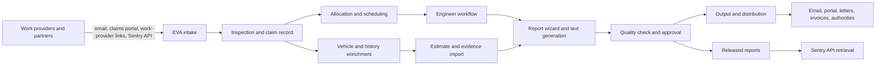

# EVA by Minotaur Software

## Executive summary

EVA, short for **Electronic Vehicle Assessment**, is presented by Minotaur Software as a bespoke, cloud-based operating system for the vehicle insurance assessor market rather than as a single-purpose estimating tool. In the reviewed sources, it spans electronic work intake, vehicle and estimate enrichment, engineer allocation, route planning, mobile inspection capture, report generation, client/work-provider portal access, correspondence, invoicing, and management reporting. The official site describes EVA as a “complete network solution” connecting insurers, assessors, engineers and claimants in one package. citeturn21view0turn21view1turn21view2

The most important technical evidence is the attached partner-facing API material for the **Sentry API**, which is positioned as EVA’s machine-to-machine interface. The uploaded API documents show a JSON-based REST API with a form-encoded token endpoint, short-lived bearer tokens, case instruction/update endpoints, report submission, and released-report retrieval. However, I did **not** find a public OpenAPI document, Swagger definition, or official machine-readable JSON Schema. The current public/partner documentation therefore appears functional but not especially developer-friendly. This matters because integration teams still need to infer a fair amount from prose tables and examples rather than consuming a formal contract. (Uploaded files: *evaapidocs.pdf*, PDF metadata author **Minotaur Software Ltd**, created **8 May 2026**; *Sentry_API_Complete_Guide.md*, sections on authentication, write endpoints, retrieval, and response model.)

The GitHub evidence is narrower but revealing. In the user-selected private repository **merceralex397-collab/collisionpdf**, I found explicit EVA planning artefacts stating that EVA handoff/import API support is **“Coming soon”** and that **folder export remains the active handoff** until authoritative EVA integration documentation is available. A merged pull request on **18 May 2026** added a disabled EVA card to the settings UI, reinforcing that EVA integration was planned but not production-enabled in that codebase. fileciteturn21file0 fileciteturn20file0 fileciteturn41file0

By contrast, the public repository **collisionengineers/cedocumentmapper** contains **no explicit EVA, Minotaur, or Sentry references** in the public README or code page text I could inspect, even though its exported field set overlaps strongly with several fields shown in the EVA user workflow. That makes cedocumentmapper best understood as an **adjacent parser/export tool with a plausible EVA-facing use case**, not as a proven official EVA integration. citeturn7view0turn7view1turn7view3 fileciteturn39file0

The bottom-line assessment is that EVA looks mature and broad in operational scope, and that real integration capability clearly exists, but the **publicly evidenced technical contract is still partial**. Product marketing and customer workflow evidence are comparatively rich; formal developer artefacts remain comparatively sparse, version-light, and in one important case internally inconsistent. citeturn21view0turn21view1turn21view2turn21view3

## Research scope and assumptions

The only enabled connector available for this research was **GitHub**. I searched the two user-selected repositories **merceralex397-collab/collisionpdf** and **merceralex397-collab/collisionautomation**, then the specified public repository **collisionengineers/cedocumentmapper**, and then broadened the search within the permitted GitHub scope. After that, I used public web sources, prioritising Minotaur’s official site and the GitHub repository pages, and I incorporated the three attached documents as primary evidence where they were more specific than the public web.

I made the following explicit assumptions where the source material left gaps:

- **“EVA” means Electronic Vehicle Assessment** throughout this report, because the official site names the product that way and the uploaded documents use the same terminology.
- **The Sentry API is treated as EVA’s partner integration API**, because the uploaded documentation repeatedly frames it as an API “built by EVA Software” for exchanging EVA claim/report data, and its base URL sits on the `evasoftware.co.uk` domain.
- **The uploaded API PDF is treated as the strongest technical primary source**, because its PDF metadata names **Minotaur Software Ltd** as author and it bears the title *Sentry API Documentation*. The attached markdown guide is useful but is treated as supplementary because its authorship and publication date are not stated in-file.
- **cedocumentmapper is treated as adjacent rather than official EVA tooling**, because I found no explicit public mention of EVA, Minotaur, or Sentry in that repository, despite the strong field overlap with EVA-style intake data. citeturn7view0turn7view1turn7view3
- **The API version is treated as v1.2**, because the uploaded PDF page headers and the uploaded markdown guide both say v1.2, even though the PDF’s table-of-contents page also contains a stray “Version 1.0” label. I therefore treat the document set as version-inconsistent rather than cleanly versioned. (Uploaded *evaapidocs.pdf*, p. 2 / PDF metadata; uploaded *Sentry_API_Complete_Guide.md*, title block.)

## Product description and functional scope

Minotaur’s official description positions EVA as a **bespoke software solution for the vehicle insurance assessor industry** and, more specifically, as a platform that coordinates communication and work exchange across insurers, assessors, engineers and claimants. The same site presents it as an “EVA Network”, implying not just software, but a connected operating environment for outsourced or distributed assessment work. I did not find an independent source verifying the marketing claim that EVA is the “largest group of engineers and assessors in the UK”, so that superlative should be treated as vendor marketing rather than an independently established market fact. citeturn21view0

Functionally, EVA appears to cover five broad layers of work.

| Functional layer | What the evidence shows | Analytical reading |
|---|---|---|
| Intake and orchestration | Electronic work-provider links, drag-and-drop instruction ingestion, claim portal intake, and emailed instructions that can auto-populate fields. citeturn21view0turn21view2 | EVA is designed to reduce re-keying at the point a new case enters the system. |
| Vehicle and estimate enrichment | Integration points are named for Glass’s Repair Estimate, GT Motive, Audatex AudaBridge, and Experian/HPI with DVLA and MIAFTR checks. citeturn21view0 | EVA acts as an aggregation layer over assessment inputs rather than a closed workflow. |
| Operational control | Intelligent engineer allocation, inspections map, route planning, diary reminders, holiday calendar, and management reporting are all vendor-described capabilities. citeturn21view1 | This looks like a workload-management system as much as a claims-assessment system. |
| Reporting and distribution | EVA generates reports, correspondence, invoices, repair authorities and other outputs, and can deliver them by email, portal, or post. citeturn21view1turn21view2 | The product sits at the centre of end-to-end case delivery, not just technical inspection. |
| Mobility and client visibility | Mobile engineer capture on phones and tablets, plus a client/work-provider claims portal showing progress, reports and images. citeturn21view1turn21view2 | EVA is meant to span office staff, field engineers, and customers. |

A useful way to read this is that EVA is not merely an estimating front end. It looks more like a **domain-specific case-management platform** for independent assessors and engineering firms, with estimating, evidence capture, output generation and partner exchange wrapped together. The official site’s language about “full correspondence”, “sales accounts”, “inspection maps”, and “turnaround times” supports that broader reading. citeturn21view1

The user roles evidenced across sources are also fairly clear. The official site explicitly mentions **insurers, assessors, engineers and claimants**, while the API guide names **insurers, claims management companies and repair networks** as external integration partners. The uploaded user guide, meanwhile, is written for operational staff preparing jobs before the engineers complete them. That gives a practical role map of: office administrators/co-ordinators, engineers, work providers/clients, claimants, and API-integrated external partners. citeturn21view0turn21view2 (Uploaded *EVA User Guide.pdf*, pp. 1-7; uploaded *Sentry_API_Complete_Guide.md*, overview section.)

## Architecture workflows and user roles

The sources support a reasonably clear high-level architecture, even though no official architecture diagram was published in the reviewed material.



This model is grounded in Minotaur’s own “How It Works” sequence: EVA receives work electronically, allocates and arranges inspections, issues work to engineers, lets engineers complete a report wizard with imported estimates and photographs, and then distributes the finished product after quality checking. citeturn21view2

The attached **EVA User Guide** adds a more operational, inside-the-office view. It instructs staff to gather an offline email copy, the instruction document, and damage images before creating a job. It then walks through “Create New Inspection”, the registration lookup, insurer/principal coding, internal and external references, incident date, inspection date/location, speedo/mileage, vehicle valuation, and photo upload. Importantly, the guide explicitly says staff use only a **small subset of the available fields**, leaving many blank. That suggests EVA’s underlying record structure is broader than the routine setup path documented for that user. (Uploaded *EVA User Guide.pdf*, p. 1.)

The photo workflow is especially revealing because it shows system-specific behaviour. The guide says the **first two photos are treated specially**: one overall vehicle image showing the registration, and one close-up of the damaged area. After those two are uploaded, the operator is told to drag in **all** images again, including those first two, because EVA handles them differently. That is a very particular workflow detail and implies EVA has report/layout logic that privileges lead photos in a way ordinary file stores do not. (Uploaded *EVA User Guide.pdf*, p. 7.)

The same user guide also confirms a practical “image-based assessment” mode. Where an inspection location cannot safely or credibly be stated, staff are told to choose **“Image-based Assessment”**. This is useful because it shows EVA is not restricted to physical engineer visits; it also supports document-and-image-led desktop workflows. That ties neatly to the official site’s “Desktop”/reporting emphasis and to the API’s inspection-type vocabulary. (Uploaded *EVA User Guide.pdf*, pp. 3-4; uploaded *Sentry_API_Complete_Guide.md*, accepted inspection values.)

From an architectural standpoint, the clearest interpretation is that EVA combines three things at once: a **case ledger**, a **workflow/orchestration layer**, and a **document/report assembly layer**. The fact that the official site advertises estimating integrations, portal delivery, map/scheduling tools, correspondence, and invoicing all inside the same product strongly supports that wider reading. citeturn21view0turn21view1turn21view2

## API surface and data contracts

The attached technical documentation shows a partner-facing API called the **Sentry API**. In plain English, that appears to be EVA’s structured way of letting another system send work in, update claim state, submit reports, and collect released reports back out.

```text
Base URL
https://sentry.evasoftware.co.uk/api/
```

The strongest primary-source evidence is the uploaded PDF *evaapidocs.pdf*, whose PDF metadata lists **Minotaur Software Ltd** as author and **8 May 2026** as creation/modification date. The document headers say **“Sentry API Documentation V1.2”**, but the table-of-contents page also contains **“Version 1.0”**. The attached markdown guide also labels the API **v1.2**. My reading is therefore that **v1.2 is the intended current version label, but the documents are internally inconsistent**. (Uploaded *evaapidocs.pdf*, PDF metadata and pp. 2-3; uploaded *Sentry_API_Complete_Guide.md*, header.)

### API shape

The reviewed materials describe the API as JSON-based for ordinary endpoints, with a single exception: authentication uses form encoding. Every endpoint requires a bearer token. The markdown guide says tokens expire after **5 minutes**, and recommends refreshing them before or near expiry rather than caching them long-term. (Uploaded *Sentry_API_Complete_Guide.md*, authentication section.)

| Endpoint | Method | Purpose | Core identifiers / keys | Notes |
|---|---|---|---|---|
| `/Connect/token` | POST | Get login token | `Client_Id`, `Client_Secret` | Uses `application/x-www-form-urlencoded`, not JSON. |
| `/Instruction/Inspection` | POST | Create new instruction | `RequestFrom`; optional case and vehicle fields | First-stage inbound claim/job creation. |
| `/Claim/LocationUpdate` | POST | Update claim location | `ClmNo + VehReg` or `EVARef + VehReg` | Supports `REPAIRER`, `INSPECTION`, `INSURED`, `THIRDPARTY`. |
| `/Claim/AuthorityStatusUpdate` | POST | Update repair authority | `ClmNo + VehReg` or `EVARef + VehReg` | Supports authority statuses such as `Yes`, `No`, `Other`, `After Instruction`. |
| `/Note/SubmitNote` | POST | Add note | `ClmNo + VehReg` or `EvaRef + VehReg` | Free-text note exchange. |
| `/Claim/Update` | POST | Update claim attributes | `ClmNo + VehReg` or `FileRef + VehReg` | Examples in the guide focus on excess/VAT status updates. |
| `/Report/SubmitReport` | POST | Submit full inspection report | `InspectEngineer`, `VehReg`, `ClmNo`, report payload | Richest payload; includes arrays and attachments. |
| `/Report/GetAvailableReports` | GET | List released reports | none beyond token | Returns report IDs, registrations, released dates. |
| `/Report/GetReport?id={id}` | GET | Retrieve a released report | `id` | Returns full report payload plus a few response-only fields. |

Source for the table above: uploaded *Sentry_API_Complete_Guide.md*, endpoint sections and quick reference; uploaded *evaapidocs.pdf*, table of contents and endpoint pages.

### Documented data formats

No official machine-readable **JSON Schema** or **OpenAPI** document was found in the reviewed sources. What we do have is a prose-plus-examples contract. In practical terms, that means there *is* a data model, but it is documented in human-oriented tables rather than in a tool-consumable schema file.

A simplified, analytical schema for **instruction creation** looks like this, derived from the uploaded guide rather than copied verbatim:

```json
{
  "RequestFrom": "string",
  "ExternalRef": "string?",
  "VehReg": "string?",
  "ClmNo": "string?",
  "PolNo": "string?",
  "InsName": "string?",
  "VehDesc": "string?",
  "DtIncident": "date-time?",
  "InspType": "Vehicle Damage Inspection | Inspect and Authorise | Inspect Only | WOP Inspection | Rectification work | Quality/Audit Inspection | Post Repair | Low Velocity Inspection | Desktop | Other",
  "VehDriveable": "Yes | No | Not Known",
  "CoverType": "Comp | TBA | TP | TPFT | WOP",
  "Urgent": "boolean?",
  "NotesStr": "string?",
  "Files": [
    {
      "Name": "string",
      "Extension": "string",
      "Data": "base64-bytes"
    }
  ]
}
```

A simplified, analytical schema for **report submission** is much larger, but the top-level structure can be understood like this:

```json
{
  "InspectEngineer": "string",
  "EvaRef": "string?",
  "VehReg": "string",
  "ClmNo": "string",
  "InsuredName": "string?",
  "ClaimType": "enum?",
  "IncidentDate": "date-time?",
  "InspectionDate": "date-time?",
  "InspectionType": "string?",
  "ReportType": "string?",
  "ReportText": "string?",
  "IsSupplementary": "boolean?",
  "Valuation": {
    "ValMarket": "decimal?",
    "ValRetail": "decimal?",
    "ValTrade": "decimal?",
    "ValMid": "decimal?",
    "ValSalvage": "decimal?",
    "ValDisposal": "decimal?"
  },
  "DamageAreas": [
    {
      "DamageSeverity": "enum",
      "DamageType": "enum",
      "DamageArea": "enum",
      "DamageLocation": "enum"
    }
  ],
  "ImpactImage": [
    { "Start": "1-8", "End": "1-8" }
  ],
  "Parts": [
    {
      "Description": "string",
      "Quantity": "integer",
      "PartType": "enum",
      "LabourTime": "float",
      "PaintTime": "float",
      "MaterialCost": "decimal",
      "Price": "decimal"
    }
  ],
  "Files": [
    {
      "Name": "string",
      "Extension": "string",
      "Data": "base64-bytes"
    }
  ]
}
```

These fragments are useful because they show the flavour of the API: structured enough for integration, but large and domain-specific enough that a downstream implementer would still want a formal schema if one existed.

### Retrieval model and practical limits

The report retrieval model is simple but restrictive. A partner first calls **GetAvailableReports**, which returns all *released* reports, and then calls **GetReport** using an `id`. The guide explicitly says there is **no dedicated search/filter endpoint**, so specific case lookup is done either by known identifier combinations on write endpoints or by **client-side filtering** of the released-report list. In plain terms, you do not ask EVA, “Find the report for this registration”; you ask for the list, then filter it yourself. (Uploaded *Sentry_API_Complete_Guide.md*, retrieval and “Obtaining Specific Cases” sections.)

The guide also states that **native batch endpoints do not exist** in v1.2. Bulk work must therefore be implemented in the client or middleware layer, reusing or refreshing JWTs as required. That is a technical limitation worth taking seriously because it shapes how connectors, sync jobs and nightly imports would have to be designed. (Uploaded *Sentry_API_Complete_Guide.md*, batch operations section.)

Finally, the standard write-response envelope is deliberately small: `StatusCode`, `Message`, and `Id`, with the `Id` primarily populated for newly created instructions. That simplicity is helpful, but it also suggests limited structured error richness compared with more modern APIs. (Uploaded *Sentry_API_Complete_Guide.md*, standard response model section.)

## GitHub evidence and integration artefacts

The connector-backed GitHub review produced one strong EVA signal, one blank result, and one ambiguous-but-interesting adjacent tool.

### collisionpdf

The clearest repository evidence sits in **merceralex397-collab/collisionpdf**. The ticket specification for the settings page says there should be an **“EVA card as a disabled/coming-soon handoff route unless target documentation is available”**, and later adds that the **“Folder export remains the active handoff”** unless a later ticket supplies the receiving-system contract. fileciteturn21file0

The paired validation note is even more explicit: it says the settings page includes an EVA card, and that **“EVA remains disabled as Coming soon with folder export as the active handoff.”** fileciteturn20file0

The merged pull request **#19** on **18 May 2026** confirms that this was implemented in the UI, not just in a ticket stub. Its summary says the team implemented settings cards for Outlook, Box, export, review/automation, and **“EVA coming soon”**. The same PR added a disabled EVA card in code. fileciteturn41file0 fileciteturn17file0

A short code excerpt from the PR patch shows the actual UI intent:

```csharp
evaCard.Children.Add(SectionTitleText("EVA"));
evaCard.Children.Add(new TextBlock { Text = "Coming soon..." });
```

Source path: `src/CollisionIntake.App/MainPage.Layout.cs` in PR #19. fileciteturn17file0

Analytically, this matters for two reasons. First, it proves that EVA was important enough to warrant a specific handoff surface in an adjacent production codebase. Secondly, it shows that, as of 18 May 2026, the team still did **not** regard its EVA documentation situation as complete enough for live integration. That is consistent with the broader evidence: the API exists, but the public/accessible contract is still rather thin.

I did **not** find direct EVA hits in my connector searches over **merceralex397-collab/collisionautomation**.

### cedocumentmapper

The public repository **collisionengineers/cedocumentmapper** is relevant because you explicitly asked for it and because it appears to solve a nearby problem: extracting data from incoming documents and exporting JSON in a downstream-friendly shape. But at the same time, the public repository pages I reviewed contain **no explicit textual references** to EVA, Minotaur, or Sentry. citeturn7view0turn7view1turn7view3

That absence is important, because it stops me from asserting a direct official integration. What the repository *does* show is a field model and export discipline that overlap strongly with EVA-style intake needs:

- `work_provider`
- `vrm`
- `vehicle_model`
- `claimant_name`
- `reference`
- `incident_date`
- `instruction_date`
- `inspection_date`
- `inspection_address`
- `accident_circumstances`
- `vat_status`
- `mileage`
- `mileage_unit` fileciteturn39file0

The README also shows that the tool’s JSON export behaviour is opinionated and strict. It says JSON export is still gated on **Work Provider**, and later documents normalisation rules such as **always exporting “Inspection Address” as six lines** and canonicalising dates to **DD/MM/YYYY** because the downstream management software expects that shape. fileciteturn26file0 fileciteturn30file0

The public code reinforces that this is a desktop parsing/export utility rather than a server-side connector. Its `app.py` exposes a fixed field list, several mapping methods, and an OCR page cap of two pages for scanned-letter style PDFs. fileciteturn39file0 fileciteturn38file0

Here the analytical judgement matters. The field overlap with the EVA user guide is real: the guide explicitly uses registration/VRM, claimant/insured, references, incident date, inspection date, inspection address or “Image-based Assessment”, and mileage. But because cedocumentmapper never publicly names EVA, the safest conclusion is this:

> **cedocumentmapper looks compatible with EVA-adjacent intake preparation, but the reviewed public evidence does not prove it is an official EVA parser or exporter.**

That inference is supported by the overlap between the cedocumentmapper field model and the uploaded *EVA User Guide.pdf* workflow, but it remains an inference, not a confirmed vendor statement. fileciteturn39file0 (Uploaded *EVA User Guide.pdf*, pp. 1-7.)

### GitHub artefacts most directly relevant to EVA

| Artefact | Path or source | What it shows | Relevance |
|---|---|---|---|
| Ticket spec | `collisionpdf/docs/collisionpdf_tickets/ticket-04-settings-page.md` fileciteturn21file0 | EVA card should remain disabled/coming-soon until authoritative docs exist | Strong evidence of planned but deferred EVA integration |
| Validation note | `collisionpdf/docs/validation/2026-05-18-ticket-04-settings-page.md` fileciteturn20file0 | “folder export” remains the active handoff | Confirms operational fallback away from live EVA integration |
| Merged PR | `collisionpdf#19` fileciteturn41file0 | EVA “coming soon” added to settings implementation | Dated proof of integration intent on 18 May 2026 |
| Public README | `cedocumentmapper/README.md` fileciteturn26file0 fileciteturn27file0 fileciteturn30file0 | JSON export gating, address/date normalisation | Useful for understanding adjacent export tooling |
| Public code | `cedocumentmapper/app.py` fileciteturn39file0 fileciteturn38file0 | Field set, mapping methods, OCR limit | Suggests a document-to-JSON pipeline that could feed EVA-like workflows |

## Security deployment privacy and known limitations

The official site’s deployment story is straightforward at a high level. It repeatedly describes EVA as a **cloud-based system** that can be accessed from home, office and the field anywhere an internet connection is available. It also describes mobile engineer capture on phones and tablets, and a claims portal that can be integrated into a client’s existing website. That supports a reading of EVA as a hosted or centrally managed platform with browser-like or network-dependent access patterns, rather than as a purely local desktop application. On-premises deployment, customer-hosted deployment, or offline-first deployment are **not** described in the reviewed sources, so those remain unspecified. citeturn21view1turn21view2

The security evidence is real but limited. Publicly, Minotaur says EVA runs on a **“fully secure Cloud platform”**, that all access requires **secure login**, and that access is **logged for auditing**. That is meaningful, but still high level. The API materials add more concrete controls: every endpoint requires a bearer token, the initial token exchange uses client credentials, and tokens are short-lived. The supplementary markdown guide explicitly recommends not storing tokens on disk or in shared caches without encryption. In plain English, EVA’s integration security looks like a conventional short-lived token model, but the public materials do not document deeper controls such as MFA, SSO, IP allow-listing, webhook signing, encryption-at-rest, or tenant isolation. citeturn21view1 (Uploaded *Sentry_API_Complete_Guide.md*, authentication and token-refresh guidance.)

Privacy and compliance details are notably thin. I did **not** find a reviewed source that clearly states:

- data residency,
- backup/retention periods,
- GDPR/DPA terms,
- encryption-at-rest specifics,
- role-based access-control matrices,
- audit-export formats,
- SSO/MFA support,
- breach-notification terms,
- or formal privacy/security white papers.

That absence does not mean EVA lacks those controls; it means they were **unspecified in the sources I reviewed**.

The platform and API also have concrete operational limitations. The Sentry API has **no native batch endpoint**, **no dedicated search/filter endpoint** for live case lookup, and a retrieval model focused on **released** reports rather than arbitrary case state. Tokens expire quickly, which is good for security but adds integration friction. And the best adjacent GitHub evidence from collisionpdf shows that at least one integration team still felt blocked by the absence of sufficiently authoritative receiving-system documentation. Together, those signals point to a platform whose operational product surface is more mature than its public integration ergonomics. fileciteturn21file0 fileciteturn20file0 (Uploaded *Sentry_API_Complete_Guide.md*, retrieval and batch sections.)

## Source artefacts and chronology

A formal EVA product changelog or version history was **not** found in the reviewed public sources. What can be assembled instead is a sparse chronology from testimonials, document metadata and GitHub artefacts.

The official site shows that EVA was in production use for at least one customer **by 2015**, had transformed another business by **2017**, and was in use at another customer **since 2018**. The attached **EVA User Guide** PDF metadata points to **21 October 2025**, while the attached **Sentry API Documentation** PDF metadata points to **8 May 2026**. The collisionpdf GitHub artefacts then show an EVA “coming soon” integration surface being ticketed, validated and merged on **18 May 2026**. citeturn21view3 fileciteturn41file0

### Compared artefacts

| Source | Type | Date | Relevance | Direct quote |
|---|---|---:|---|---|
| Minotaur official EVA site citeturn21view0turn21view1turn21view2turn21view3 | Official public website | Live as reviewed on 23 May 2026 | Best public source for product description, features, workflow, customer evidence and cloud/security claims | “complete network solution” |
| Uploaded file *evaapidocs.pdf* | PDF technical documentation | 8 May 2026 (PDF metadata) | Strongest technical primary source for API existence, version label, author and endpoint set | “Sentry API Documentation V1.2” |
| Uploaded file *Sentry_API_Complete_Guide.md* | Supplementary technical guide | Unspecified in-file | Best readable source for endpoint tables, identifier logic, batch limitations and retrieval model | “tokens expire after 5 minutes” |
| Uploaded file *EVA User Guide.pdf* | Operational/user guide | 21 Oct 2025 (PDF metadata) | Best source for real user workflow, field entry sequence and photo handling | “Create New Inspection” |
| `collisionpdf` ticket spec fileciteturn21file0 | Private GitHub documentation | 18 May 2026 (document date) | Direct evidence of intended EVA handoff and documentation gap | “Coming soon” |
| `collisionpdf` validation note fileciteturn20file0 | Private GitHub validation doc | 18 May 2026 | Confirms EVA remained disabled and folder export stayed active | “active handoff” |
| `collisionpdf` PR #19 fileciteturn41file0 | Private GitHub pull request | 18 May 2026 | Dated implementation evidence for EVA UI placeholder | “EVA coming soon” |
| `cedocumentmapper` README fileciteturn26file0 fileciteturn27file0 fileciteturn30file0 | Public GitHub README/changelog | Repo current state as reviewed | Strong adjacent evidence for strict JSON export/normalisation, but not an explicit EVA source | “JSON export still requires Work Provider” |
| `cedocumentmapper` app.py fileciteturn39file0 fileciteturn38file0 | Public GitHub source code | Repo current state as reviewed | Best code evidence for parsed/exported field set and mapping logic | “DEFAULT_FIELDS” |
| `cedocumentmapper` public repo page citeturn6view0turn7view0turn7view1turn7view3 | Public GitHub repository page | Repo current state as reviewed | Evidence that no public EVA/Minotaur/Sentry discussion was visible there in the reviewed pages | “Issues 0” |

The most defensible synthesis is therefore this: **EVA is clearly a real, feature-rich, cloud-oriented platform with mature operational workflows and a real partner API, but its externally visible technical contract is still incomplete enough that adjacent tools and integration projects are compensating with local export conventions, UI placeholders, and manual normalisation.** That is not unusual for a long-running domain product, but it does mean anyone building a serious EVA integration would still want direct vendor confirmation on schema, security, tenancy, deployment, support boundaries and versioning before treating the reviewed materials as fully authoritative.